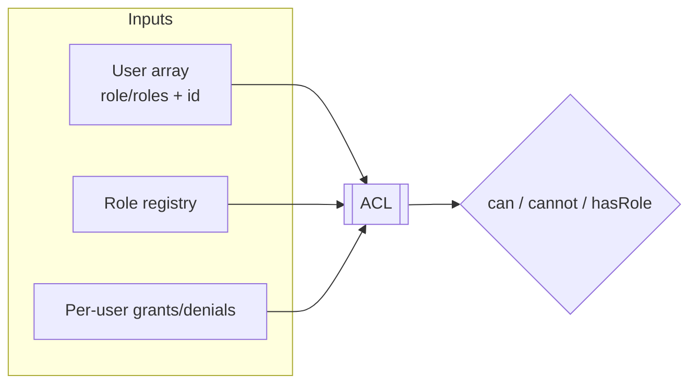
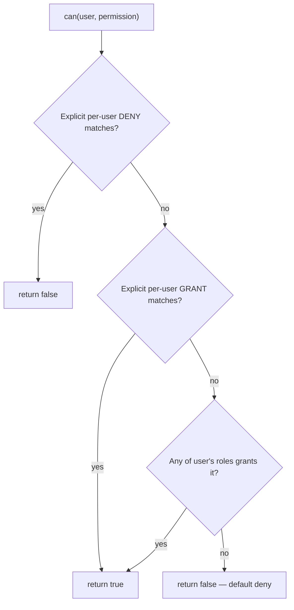

# Access Control List (ACL)

The `DMF\Auth\ACL` authorization engine — how "may this user do this?" is
decided by combining roles, permissions, and per-user overrides.

> **Applies to template version:** `1.1.0` · **Namespace:** `DMF\Auth`
> **Requires:** PHP 8.2+ · **Last updated:** 2026-07-14

The ACL is the single decision point for authorization. It reads the role model
described in [ROLE_MODEL.md](./ROLE_MODEL.md) and enforces it through the
[middleware](./AUTHENTICATION.md#middleware). It contains no business rules.

---

## Table of Contents

1. [Responsibilities](#responsibilities)
2. [Decision Algorithm](#decision-algorithm)
3. [Role Checks](#role-checks)
4. [Permission Checks](#permission-checks)
5. [Per-User Overrides](#per-user-overrides)
6. [Wildcards & Precedence](#wildcards--precedence)
7. [Using the ACL in Middleware](#using-the-acl-in-middleware)
8. [Persistence Notes](#persistence-notes)
9. [API Reference](#api-reference)
10. [Cross References](#cross-references)

---

## Responsibilities



The ACL never touches the session or the database directly — it decides purely
from the user array it is handed plus the in-memory role registry and override
tables. That keeps authorization deterministic and testable.

---

## Decision Algorithm

`can($user, $permission)` resolves in a fixed precedence order:



1. **Deny** overrides everything (fail-safe).
2. **Grant** — an explicit per-user allowance.
3. **Role** — a permission reachable through the user's role(s), including
   inheritance and wildcards.
4. **Default deny** — nothing matched.

---

## Role Checks

```php
use DMF\Auth\ACL;

$acl = new ACL();
$user = ['id' => 5, 'role' => 'editor'];

$acl->hasRole($user, 'editor');            // true
$acl->hasRole($user, 'admin', 'editor');   // true (any-of)
$acl->hasAllRoles($user, 'editor', 'admin'); // false (all-of)
```

---

## Permission Checks

```php
$acl->can($user, 'post.create');            // bool
$acl->cannot($user, 'user.manage');         // bool
$acl->canAny($user, ['post.edit', 'post.create']);  // any-of
$acl->canAll($user, ['post.edit', 'post.publish']); // all-of
```

Role-derived permissions honor hierarchy and wildcards (see
[ROLE_MODEL.md](./ROLE_MODEL.md#wildcards)).

---

## Per-User Overrides

Grant or deny capabilities to a specific user, independent of their role:

```php
$acl->grant(5, 'report.export');            // user 5 may export, even if their role can't
$acl->deny(9, 'post.delete');               // user 9 may never delete, even as admin
$acl->revoke(5, 'report.export');           // remove the override
```

```mermaid
flowchart LR
    subgraph User 9 = admin (role grants *)
        A[can post.delete?] --> D[explicit DENY] --> F[false]
    end
    subgraph User 5 = viewer (role lacks it)
        B[can report.export?] --> G[explicit GRANT] --> T[true]
    end
```

Deny always beats grant, and both beat role-derived permissions — the safest
resolution.

---

## Wildcards & Precedence

Overrides and role permissions share the same matcher (`Role::matches`):

| Rule | Example | Effect |
| ---- | ------- | ------ |
| Exact | `post.create` | that permission only |
| Family | `post.*` | any `post.` capability |
| All | `*` | everything |

Precedence, strongest first: **per-user deny → per-user grant → role permission
→ default deny**.

---

## Using the ACL in Middleware

The `RoleMiddleware` and `PermissionMiddleware` delegate their decisions to the
ACL:

```php
use DMF\Auth\Middleware\{RoleMiddleware, PermissionMiddleware};

// Role gate
$router->get('/admin', $handler)
       ->middleware(new RoleMiddleware($auth, $acl, 'admin', 'super_admin'));

// Permission gate (all required by default; pass false for any-of)
$router->post('/posts', $handler)
       ->middleware(new PermissionMiddleware($auth, $acl, 'post.create'));

$router->delete('/posts/{id}', $handler)
       ->middleware(new PermissionMiddleware($auth, $acl, ['post.delete', 'post.manage'], requireAll: false));
```

A guest hits 401 (or a login redirect); an authenticated-but-unauthorized user
hits 403. See [AUTHENTICATION.md](./AUTHENTICATION.md#middleware).

---

## Persistence Notes

Per-user grants/denials are held **in memory** on the ACL instance — the package
imposes no storage schema. If your application persists overrides, load them into
the ACL at request time:

```php
foreach ($db->select('SELECT user_id, permission, effect FROM user_permissions WHERE user_id = ?', [$id]) as $row) {
    $row['effect'] === 'deny'
        ? $acl->deny((int) $row['user_id'], $row['permission'])
        : $acl->grant((int) $row['user_id'], $row['permission']);
}
```

Roles/permissions themselves live in the `Role`/`Permission` registries,
declared once at bootstrap.

---

## API Reference

| Method | Returns | Purpose |
| ------ | ------- | ------- |
| `can($user, $perm)` | bool | Is the permission allowed? |
| `cannot($user, $perm)` | bool | Negation of `can`. |
| `canAny($user, $perms)` | bool | Any of the permissions. |
| `canAll($user, $perms)` | bool | All of the permissions. |
| `hasRole($user, ...$roles)` | bool | Holds any listed role. |
| `hasAllRoles($user, ...$roles)` | bool | Holds every listed role. |
| `grant($userId, ...$perms)` | void | Add a per-user allowance. |
| `deny($userId, ...$perms)` | void | Add a per-user denial. |
| `revoke($userId, ...$perms)` | void | Remove an override. |

---

## Cross References

- [ROLE_MODEL.md](./ROLE_MODEL.md) — roles, permissions, hierarchy, wildcards
- [AUTHENTICATION.md](./AUTHENTICATION.md) — login + middleware
- [SESSION_FLOW.md](./SESSION_FLOW.md) — how the user reaches the ACL
- [SECURITY.md](./SECURITY.md#owasp-top-10-coverage) — A01 Broken Access Control

---

<sub>DMF PHP Template · Access Control List · v1.1.0 · © 2026 Digital Media Foundation</sub>
