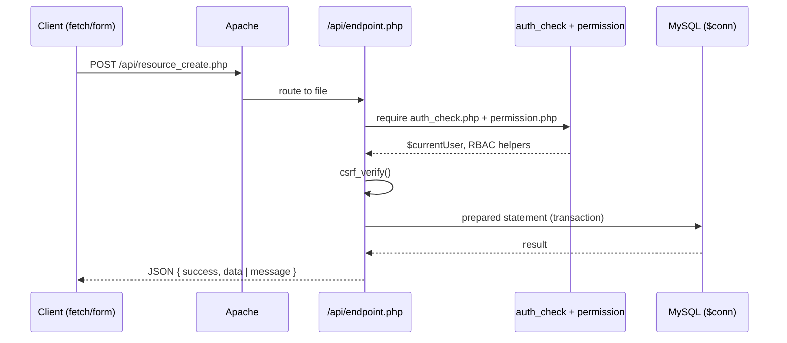
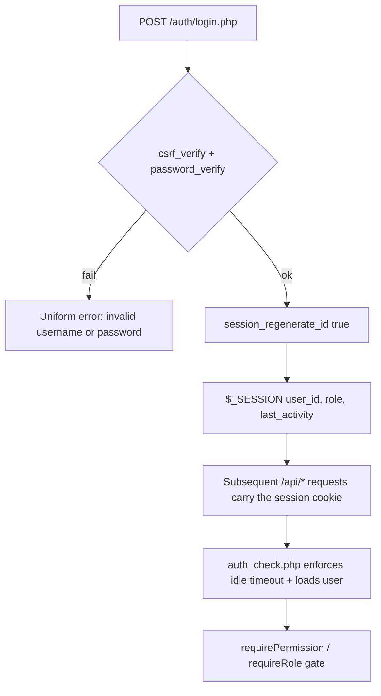

# API Guide

REST/JSON conventions, authentication, status codes, and error handling for
endpoints in applications built on the **DMF PHP Template**.

> **Applies to template version:** `1.1.0` · **Last updated:** 2026-07-14

---

## Table of Contents

1. [Overview](#overview)
2. [Endpoint Conventions](#endpoint-conventions)
3. [Request Format](#request-format)
4. [JSON Response Format](#json-response-format)
5. [HTTP Status Codes](#http-status-codes)
6. [Authentication](#authentication)
7. [CSRF Protection](#csrf-protection)
8. [Error Handling](#error-handling)
9. [Worked Example](#worked-example)
10. [Cross References](#cross-references)

---

## Overview

The platform uses **file-based routing** (no rewrite engine): each endpoint is a
PHP file under `public_html/api/`. Endpoints are typically `POST`, share the
authenticated session, and return JSON. They support both `XHR` (AJAX) and
classic form submissions.



---

## Endpoint Conventions

| Rule | Detail |
| ---- | ------ |
| Location | `public_html/api/<verb>_<resource>.php` (e.g. `create_document.php`). |
| Method | State-changing endpoints use `POST`. Reject others with `405`. |
| Content type | Respond with `Content-Type: application/json; charset=utf-8`. |
| Auth | Include `auth_check.php`; gate with `requirePermission()` / `requireRole()`. |
| CSRF | Verify `csrf_verify()` on every POST. |
| Idempotency | Use transactions for multi-step writes (see [DATABASE.md](./DATABASE.md#database-conventions)). |
| Naming | Route keys in `includes/routes.php` are dot-namespaced, e.g. `api.document.create`. |

Method guard:

```php
if ($_SERVER['REQUEST_METHOD'] !== 'POST') {
    http_response_code(405);
    header('Allow: POST');
    header('Content-Type: application/json');
    echo json_encode(['success' => false, 'message' => 'Method not allowed']);
    exit;
}
```

---

## Request Format

`POST` bodies may be `application/x-www-form-urlencoded` (forms) or JSON (AJAX).
Detect and normalize:

```php
$raw = file_get_contents('php://input');
$input = str_contains($_SERVER['CONTENT_TYPE'] ?? '', 'application/json')
    ? (json_decode($raw, true) ?? [])
    : $_POST;

$title = trim((string) ($input['title'] ?? ''));
```

AJAX requests should send:

```
X-Requested-With: XMLHttpRequest
X-CSRF-Token: <token from csrf_token()>
Content-Type: application/json
```

---

## JSON Response Format

A single, consistent envelope for **every** endpoint.

**Success:**

```json
{
  "success": true,
  "data": {
    "id": 42,
    "title": "Quarterly report"
  }
}
```

**Success with a list (paginated):**

```json
{
  "success": true,
  "data": [ { "id": 42 }, { "id": 43 } ],
  "meta": { "page": 1, "per_page": 20, "total": 57 }
}
```

**Error:**

```json
{
  "success": false,
  "message": "Title is required.",
  "errors": { "title": "This field is required." }
}
```

| Field | Type | When |
| ----- | ---- | ---- |
| `success` | boolean | Always. |
| `data` | object \| array | On success. |
| `meta` | object | On paginated lists. |
| `message` | string | On error (human-readable, safe to display). |
| `errors` | object | On validation failure (field → message). |

Helper:

```php
function json_response(array $payload, int $status = 200): never
{
    http_response_code($status);
    header('Content-Type: application/json; charset=utf-8');
    echo json_encode($payload, JSON_UNESCAPED_UNICODE);
    exit;
}
```

---

## HTTP Status Codes

| Code | Meaning | Use |
| ---- | ------- | --- |
| `200 OK` | Success | Read / update succeeded. |
| `201 Created` | Created | Resource created. |
| `204 No Content` | Success, no body | Delete succeeded. |
| `400 Bad Request` | Malformed input | Missing/invalid parameters. |
| `401 Unauthorized` | Not authenticated | No/expired session. |
| `403 Forbidden` | Not authorized | RBAC denied or CSRF failed. |
| `404 Not Found` | Missing | Unknown resource. |
| `405 Method Not Allowed` | Wrong verb | Non-POST to a POST endpoint. |
| `409 Conflict` | State conflict | Duplicate unique key, concurrent edit. |
| `422 Unprocessable Entity` | Validation | Well-formed but semantically invalid. |
| `429 Too Many Requests` | Rate limited | Login/throttle exceeded. |
| `500 Internal Server Error` | Server fault | Unexpected exception (never leak details). |

---

## Authentication

Endpoints reuse the **session** established at login — there is no separate token
system in the base template. The flow:



In an endpoint:

```php
require_once __DIR__ . '/../../includes/auth_check.php';   // 401-style redirect if anonymous
require_once __DIR__ . '/../../includes/permission.php';
require_once __DIR__ . '/../../includes/csrf.php';

csrf_require();                          // 403 on bad token
requireRole($currentUser, 'admin');     // 403 if role not allowed
```

> A stateless bearer-token / API-key layer is planned — see
> [ROADMAP.md](./ROADMAP.md).

---

## CSRF Protection

Every state-changing request must present a valid token. See
[SECURITY.md](./SECURITY.md#csrf).

- Forms: embed `csrf_field()`.
- AJAX: send the token from `csrf_token()` in the `X-CSRF-Token` header (or body)
  and validate with `csrf_verify()` / `csrf_require()`.

```js
await fetch('/api/create_document.php', {
  method: 'POST',
  headers: {
    'Content-Type': 'application/json',
    'X-Requested-With': 'XMLHttpRequest',
    'X-CSRF-Token': window.CSRF_TOKEN
  },
  body: JSON.stringify({ title: 'Quarterly report' })
});
```

---

## Error Handling

- **Never leak internals.** Return a generic `message` to the client and log the
  detail server-side.
- Validation errors → `422` with a per-field `errors` object.
- Authorization failures → `403` (the template's `requirePermission()` already
  emits the correct JSON for XHR callers).
- Wrap the handler body and convert uncaught exceptions to `500`:

```php
try {
    // ... validate, then write within a transaction ...
    json_response(['success' => true, 'data' => $doc], 201);
} catch (Throwable $e) {
    if (APP_DEBUG) {
        error_log('[api] ' . $e->getMessage());
    }
    json_response(['success' => false, 'message' => 'Something went wrong.'], 500);
}
```

---

## Worked Example

`public_html/api/create_document.php`:

```php
<?php
declare(strict_types=1);

require_once __DIR__ . '/../../includes/auth_check.php';
require_once __DIR__ . '/../../includes/permission.php';
require_once __DIR__ . '/../../includes/csrf.php';

if ($_SERVER['REQUEST_METHOD'] !== 'POST') {
    http_response_code(405);
    header('Allow: POST');
    exit(json_encode(['success' => false, 'message' => 'Method not allowed']));
}

csrf_require();
requireRole($currentUser, 'admin', 'super_admin');

$title = trim((string) ($_POST['title'] ?? ''));
if ($title === '') {
    http_response_code(422);
    header('Content-Type: application/json');
    exit(json_encode([
        'success' => false,
        'message' => 'Validation failed.',
        'errors'  => ['title' => 'Title is required.'],
    ]));
}

try {
    $conn->beginTransaction();
    $stmt = $conn->prepare('INSERT INTO documents (owner_id, title) VALUES (?, ?)');
    $stmt->execute([$userId, $title]);
    $id = (int) $conn->lastInsertId();

    $conn->prepare('INSERT INTO audit_logs (user_id, action, entity, entity_id, ip_address) VALUES (?, ?, ?, ?, ?)')
         ->execute([$userId, 'document.create', 'documents', $id, $_SERVER['REMOTE_ADDR'] ?? null]);
    $conn->commit();

    http_response_code(201);
    header('Content-Type: application/json');
    echo json_encode(['success' => true, 'data' => ['id' => $id, 'title' => $title]], JSON_UNESCAPED_UNICODE);
} catch (Throwable $e) {
    $conn->rollBack();
    if (APP_DEBUG) { error_log('[api] ' . $e->getMessage()); }
    http_response_code(500);
    header('Content-Type: application/json');
    echo json_encode(['success' => false, 'message' => 'Something went wrong.']);
}
```

> `documents` is illustrative only — it is **not** part of the template's core
> schema. Define your own domain tables per [DATABASE.md](./DATABASE.md).

---

## Cross References

- [ARCHITECTURE.md](./ARCHITECTURE.md#request-flow) — the include chain
- [SECURITY.md](./SECURITY.md) — CSRF, headers, input validation
- [DATABASE.md](./DATABASE.md#database-conventions) — transactions & prepared statements
- [INSTALL.md](./INSTALL.md) — deployment
- [ROADMAP.md](./ROADMAP.md) — planned token auth & pagination helpers

---

<sub>DMF PHP Template · API Guide · v1.1.0 · © 2026 Digital Media Foundation</sub>
