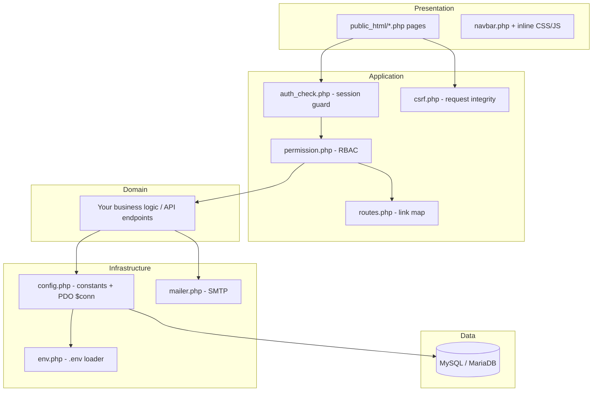
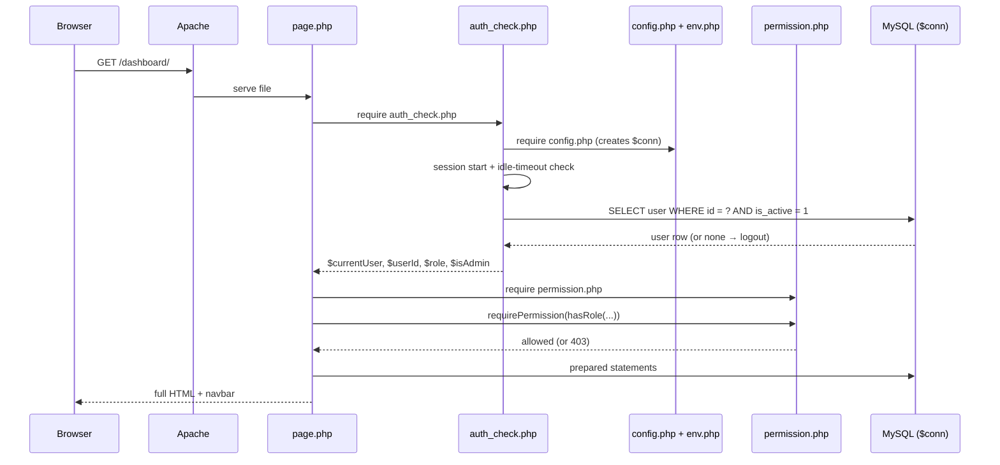
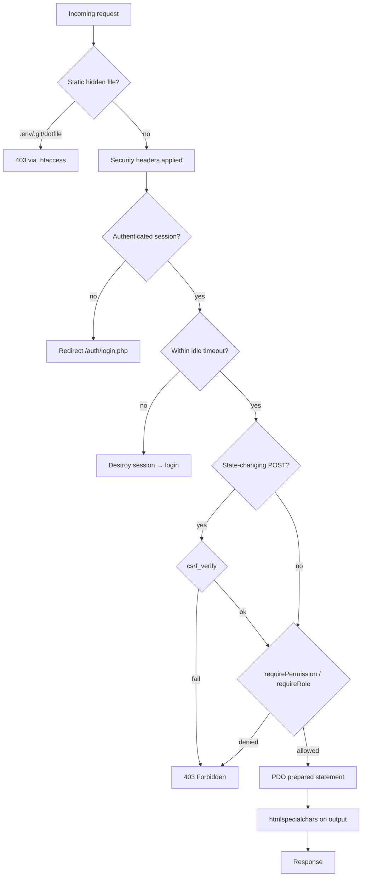
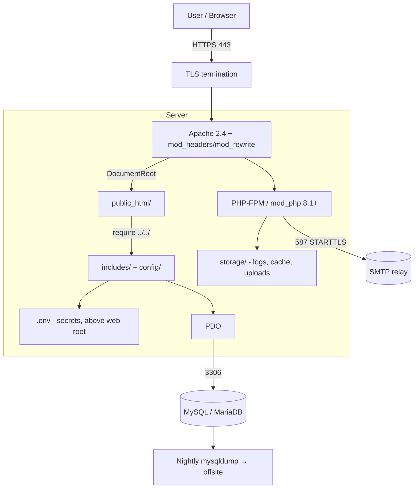

# Architecture Guide

The application layers, folder structure, request flow, security flow, and
deployment model of the **DMF PHP Template**.

> **Applies to template version:** `1.1.0` · **Last updated:** 2026-07-14

This template extracts the *reusable architecture* of the DMF platform's
reference implementation (`projects.dmf.ac.th`) with **all business logic
removed**. It is the same plain-procedural-PHP shape — generalized and hardened
— not a new architecture.

---

## Table of Contents

1. [Design Principles](#design-principles)
2. [Application Layers](#application-layers)
3. [Folder Structure](#folder-structure)
4. [Component Map](#component-map)
5. [Request Flow](#request-flow)
6. [Security Flow](#security-flow)
7. [Database Layer](#database-layer)
8. [Deployment Diagram](#deployment-diagram)
9. [Cross References](#cross-references)

---

## Design Principles

| Principle | Meaning |
| --------- | ------- |
| No runtime framework | Plain procedural PHP + PDO. Composer is dev-tooling only. |
| One web root | Only `public_html/` is served; everything else lives above it. |
| Config from environment | Secrets in git-ignored `.env`, never in source. |
| Prepared statements only | No string-built SQL, anywhere. |
| Secure by default | CSRF, headers, session hardening, RBAC shipped in the baseline. |
| Convention over configuration | Fixed include chain and route map every page follows. |

---

## Application Layers



| Layer | Responsibility | Lives in |
| ----- | -------------- | -------- |
| Presentation | HTML pages, navigation, inline assets | `public_html/`, `includes/navbar.php` |
| Application | Auth, RBAC, routing, CSRF | `includes/` |
| Domain | Business rules & API endpoints (per app) | `public_html/api/`, app modules |
| Infrastructure | Config, DB connection, email | `config/`, `includes/env.php`, `includes/mailer.php` |
| Data | Persistent storage | MySQL/MariaDB |

---

## Folder Structure

```text
dmf-template-php/
├── config/
│   └── config.php           # constants + shared PDO $conn (reads .env)
├── includes/                # reusable architecture (ABOVE the web root)
│   ├── env.php              #   dependency-free .env loader
│   ├── auth_check.php       #   session guard → $currentUser, $role, …
│   ├── permission.php       #   RBAC primitives + requirePermission()
│   ├── csrf.php             #   CSRF token helpers
│   ├── routes.php           #   ROUTES map + route()/redirect()
│   ├── mailer.php           #   dependency-free SMTP client
│   └── navbar.php           #   shared navigation component
├── public_html/             # THE ONLY WEB DOCUMENT ROOT
│   ├── .htaccess            #   security headers + dotfile blocking
│   ├── index.php            #   entry redirect
│   ├── auth/                #   login.php, logout.php
│   ├── dashboard/           #   reference page (the include-chain pattern)
│   └── uploads/             #   web-served public assets (no PHP execution)
├── database/
│   ├── migrations/          # ordered .sql schema migrations (core only)
│   └── seeds/               # seed data
├── storage/                 # runtime, git-ignored (cache, logs, uploads)
├── tests/                   # PHPUnit smoke tests
├── docs/                    # supplementary docs
├── .env.example             # environment template
├── composer.json            # dev tooling (PHPStan, PHPUnit, PHP-CS-Fixer)
├── phpstan.neon.dist        # static analysis config
├── phpunit.xml.dist         # test config
└── VERSION                  # semantic version
```

> **Boundary:** `public_html/` is served; `config/`, `includes/`, `database/`,
> `storage/`, `tests/` are not reachable over HTTP. This is a hardening
> improvement over the reference, which kept these inside the document root.

---

## Component Map

| File | Responsibility |
| ---- | -------------- |
| `config/config.php` | Define constants; create the single `$conn` (PDO). |
| `includes/env.php` | Parse `.env` once; expose `env($key, $default)`. |
| `includes/auth_check.php` | Start session, enforce idle timeout, load `$currentUser`, set `$userId`/`$role`/`$isAdmin`/`$avatarPath`. |
| `includes/permission.php` | `hasRole()`, `isAdminRole()`, `requireRole()`, `requireLogin()`, `requirePermission()`. |
| `includes/csrf.php` | `csrf_token()`, `csrf_field()`, `csrf_verify()`, `csrf_require()`. |
| `includes/routes.php` | `ROUTES` map + `route()`, `routeUrl()`, `redirect()`, `routeTitle()`, `routeActive()`. |
| `includes/mailer.php` | `sendMail()` — STARTTLS SMTP, no dependencies. |
| `includes/navbar.php` | Render navigation from `ROUTES`, respecting the `admin` flag. |

---

## Request Flow

Every authenticated page follows the same skeleton (see
`public_html/dashboard/index.php`):



Include chain, in code:

```php
require_once __DIR__ . '/../../includes/auth_check.php';  // 1. session → globals
require_once __DIR__ . '/../../includes/permission.php';  // 2. RBAC helpers
require_once __DIR__ . '/../../includes/routes.php';      // 3. link helpers
requirePermission(hasRole($role, 'admin'));               // 4. gate (optional)
// 5. SQL via $conn  → 6. compute view  → 7. render HTML
require_once __DIR__ . '/../../includes/navbar.php';      // 8. navigation
```

---

## Security Flow



Controls and where they live — full detail in [SECURITY.md](./SECURITY.md):

| Control | Location |
| ------- | -------- |
| Dotfile / sensitive-extension blocking | `public_html/.htaccess` |
| Security response headers | `public_html/.htaccess` |
| No code execution in uploads | `public_html/uploads/.htaccess` |
| Session fixation defense | `session_regenerate_id(true)` in `login.php` |
| Idle timeout | `auth_check.php` |
| CSRF | `includes/csrf.php` |
| RBAC gate | `includes/permission.php` |
| SQL injection defense | prepared statements via `$conn` |
| Secrets isolation | `.env` + `includes/env.php` |

---

## Database Layer

- Single global `$conn` (PDO) created in `config/config.php`.
- `PDO::ERRMODE_EXCEPTION`, `FETCH_ASSOC`, `EMULATE_PREPARES => false`.
- Prepared statements with positional `?` parameters everywhere.
- Transactions for multi-step writes.
- Connection failure fails closed with a generic JSON error — never leaks
  credentials.

See [DATABASE.md](./DATABASE.md) for conventions, indexes, and migrations.

---

## Deployment Diagram



**Deployment invariants:**

- Document root = `public_html/`. Nothing above it is web-accessible.
- `.env` sits at the project root, outside `public_html/`.
- `storage/` is the only web-server-writable tree.
- HTTPS enforced; HSTS enabled once TLS is in place.

---

## Cross References

- [INSTALL.md](./INSTALL.md) — provisioning & deployment steps
- [DATABASE.md](./DATABASE.md) — data layer detail
- [API.md](./API.md) — endpoint conventions
- [SECURITY.md](./SECURITY.md) — full hardening baseline
- [ROADMAP.md](./ROADMAP.md) — evolution of the architecture
- [docs/architecture.md](./docs/architecture.md) — concise companion overview

---

<sub>DMF PHP Template · Architecture Guide · v1.1.0 · © 2026 Digital Media Foundation</sub>
