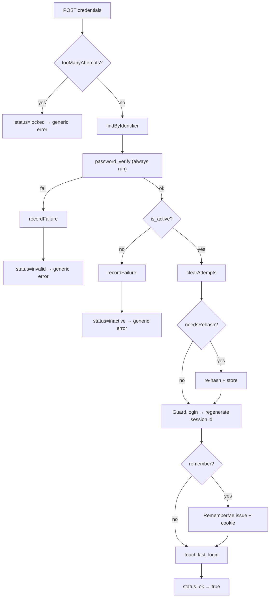
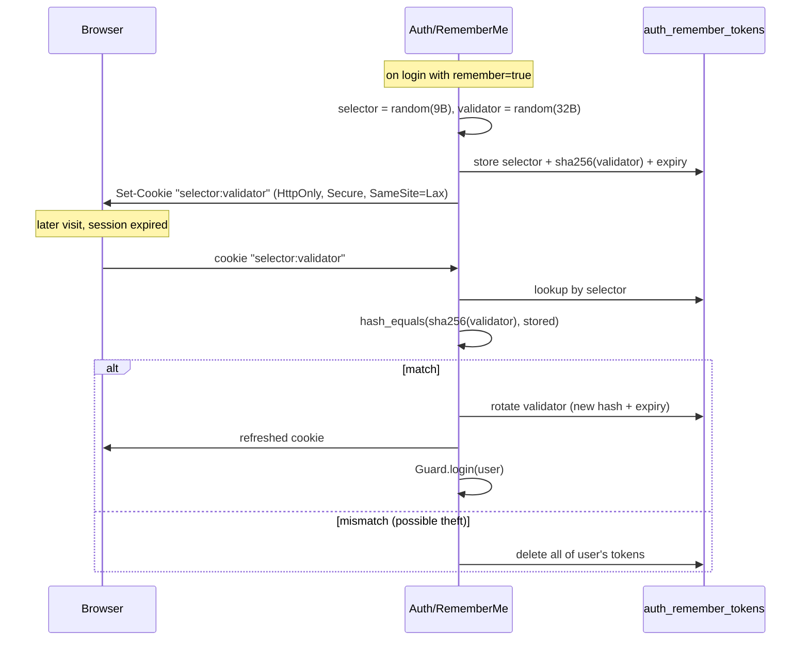
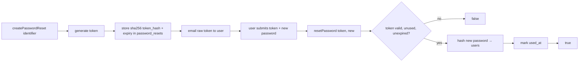

# Authentication

The `DMF\Auth` package — session login, "remember me", password hashing and
reset, brute-force protection, and CSRF — built entirely on top of the frozen
Core Framework.

> **Applies to template version:** `1.1.0` · **Namespace:** `DMF\Auth`
> **Requires:** PHP 8.2+ · **Last updated:** 2026-07-14

The Auth package contains **no business logic** and adds **no dependencies**. It
composes Core (`Session`, `Database`, `Request`, `Response`, `Middleware`) and is
loaded by its own autoloader, which pulls in Core first.

---

## Table of Contents

1. [Components](#components)
2. [Loading the Package](#loading-the-package)
3. [Required Database Tables](#required-database-tables)
4. [Login Flow](#login-flow)
5. [Brute-Force Protection & Rate Limiting](#brute-force-protection--rate-limiting)
6. [Remember Me](#remember-me)
7. [Password Hashing](#password-hashing)
8. [Password Reset](#password-reset)
9. [CSRF](#csrf)
10. [Middleware](#middleware)
11. [Security Guarantees](#security-guarantees)
12. [Cross References](#cross-references)

---

## Components

| Class | Responsibility |
| ----- | -------------- |
| `Auth` | Orchestrates login: credentials, throttle, generic error, remember, reset. |
| `Guard` | Session identity: login/logout, id regeneration, current-user cache. |
| `Password` | `password_hash`/`verify`/`needsRehash`, reset tokens, strength policy. |
| `RememberMe` | Persistent login via selector/validator token + secure cookie. |
| `CSRF` | Per-session token generation, form field / meta tag, verification. |
| `Role` · `Permission` · `ACL` | Authorization — see [ROLE_MODEL.md](./ROLE_MODEL.md) and [ACL.md](./ACL.md). |
| `Middleware/*` | `Auth`, `Guest`, `Role`, `Permission` route guards. |

---

## Loading the Package

```php
require_once __DIR__ . '/../includes/Auth/autoload.php'; // also loads Core

use DMF\Core\{Database, Session};
use DMF\Auth\{Auth, Password, RememberMe};

$session = new Session(1800);
$session->start();

$db = Database::connection('default');

$auth = new Auth(
    $db,
    $session,
    new Password(),
    new RememberMe($db, ['secure' => true]),
);
```

`Auth`'s database argument is nullable: identity-only use (a pre-loaded user via
`login()`, `logout()`, `check()`, `user()` from cache) works without it, which
suits SSO flows and tests. DB-backed operations throw if no connection was given.

---

## Required Database Tables

The package reuses the template's core schema (`users`, `login_attempts`,
`password_resets` from `database/migrations/0001_core_schema.sql`) and adds one
table for persistent logins. Add it in your application's own migration:

```sql
CREATE TABLE IF NOT EXISTS `auth_remember_tokens` (
    `id`             BIGINT UNSIGNED NOT NULL AUTO_INCREMENT,
    `user_id`        BIGINT UNSIGNED NOT NULL,
    `selector`       CHAR(18)        NOT NULL,
    `validator_hash` CHAR(64)        NOT NULL,   -- sha256 of the validator
    `expires_at`     DATETIME        NOT NULL,
    `created_at`     DATETIME        NOT NULL DEFAULT CURRENT_TIMESTAMP,
    PRIMARY KEY (`id`),
    UNIQUE KEY `uq_art_selector` (`selector`),
    KEY `idx_art_user` (`user_id`),
    CONSTRAINT `fk_art_user` FOREIGN KEY (`user_id`) REFERENCES `users` (`id`) ON DELETE CASCADE
) ENGINE=InnoDB DEFAULT CHARSET=utf8mb4 COLLATE=utf8mb4_unicode_ci;
```

The `users` table columns consumed by `Auth` are configurable
(`identifier`, `password_field`, `id_field`, `active_field`) — the defaults match
the core schema.

---

## Login Flow



```php
if ($auth->attempt($username, $password, remember: (bool) ($_POST['remember'] ?? false))) {
    header('Location: /dashboard/');
    exit;
}
$error = $auth->errorMessage();   // always generic — never reveals which field failed
```

---

## Brute-Force Protection & Rate Limiting

Failures are recorded in `login_attempts` (username + IP). Before verifying,
`Auth` checks whether the identifier/IP has reached `max_attempts` (default 5)
within the `decay_seconds` window (default 900s / 15 min). While locked, every
attempt short-circuits with the generic "too many attempts" message.

```php
$auth->tooManyAttempts($username, $ip);   // bool
$auth->attemptsRemaining($username, $ip);  // int
$auth->availableIn($username, $ip);        // seconds until unlock
```

Successful login clears the failure rows for that identifier/IP.

---

## Remember Me

Persistent login uses the **selector/validator** pattern:



Only the validator **hash** is stored, so a database leak cannot forge a login.
The validator is rotated on every use.

---

## Password Hashing

`Password` wraps the native `password_*` API (bcrypt by default; argon2id when
configured). Hashes are transparently upgraded on login via `needsRehash()`.

```php
$hash = (new Password())->hash($plain);
$ok   = (new Password())->verify($plain, $hash);

$pw = new Password();
if (!$pw->meetsPolicy($plain, minLength: 10)) {
    $errors = $pw->policyErrors();
}
```

---

## Password Reset

Tokens are single-use and time-boxed; only the **SHA-256 hash** is stored.



```php
$token = $auth->createPasswordReset($email);   // null if no such account (respond uniformly)
// ...email $token via Core\Mail...
$ok = $auth->resetPassword($token, $newPassword);
```

---

## CSRF

```php
use DMF\Auth\CSRF;

$csrf = new CSRF($session);
echo $csrf->field();          // <input type="hidden" name="csrf_token" ...>
echo $csrf->metaTag();        // <meta name="csrf-token" ...> for fetch()

// On POST:
if (!$csrf->check($request)) { /* 403 */ }
$csrf->rotate();              // after login / privilege change
```

Tokens are 256-bit, per-session, and compared with `hash_equals()`. See
[SECURITY.md](./SECURITY.md#csrf).

---

## Middleware

All extend the frozen `DMF\Core\Middleware`, so they plug straight into `Router`
or `Bootstrap`. They return a JSON error for API/AJAX requests and a
redirect/HTML page otherwise.

| Middleware | Guards | On failure |
| ---------- | ------ | ---------- |
| `AuthMiddleware` | authenticated | 401 / redirect to login (`?redirect=`) |
| `GuestMiddleware` | not authenticated | 403 / redirect home |
| `RoleMiddleware` | user has a role | 401 if guest, else 403 |
| `PermissionMiddleware` | user has permission(s) | 401 if guest, else 403 |

```php
use DMF\Auth\Middleware\{AuthMiddleware, RoleMiddleware, PermissionMiddleware};

$router->get('/admin', $handler)->middleware(new AuthMiddleware($auth), new RoleMiddleware($auth, $acl, 'admin'));
$router->post('/posts', $handler)->middleware(new PermissionMiddleware($auth, $acl, 'post.create'));
```

---

## Security Guarantees

| Requirement | How |
| ----------- | --- |
| Session login | `Guard` over Core `Session` |
| Session regeneration | `session_regenerate_id(true)` on login/logout |
| Session timeout | Core `Session` idle timeout |
| Secure cookies | `RememberMe` sets HttpOnly + Secure + SameSite=Lax |
| Password hash | `password_hash` (bcrypt/argon2) + auto-rehash |
| Brute-force protection | `login_attempts` throttle |
| Rate limiter | `tooManyAttempts` / `availableIn` window |
| Generic login error | one message for invalid/inactive/locked |
| CSRF | `CSRF` token + `hash_equals` |
| Remember me | selector/validator, hashed validator, rotation |
| Password reset | hashed single-use, time-boxed tokens |

---

## Cross References

- [SESSION_FLOW.md](./SESSION_FLOW.md) — session lifecycle in detail
- [ROLE_MODEL.md](./ROLE_MODEL.md) — roles, permissions, hierarchy
- [ACL.md](./ACL.md) — the authorization decision engine
- [SECURITY.md](./SECURITY.md) — platform security baseline
- [BOOTSTRAP.md](./BOOTSTRAP.md) — wiring Auth into the kernel
- [CLASS_DIAGRAM.md](./CLASS_DIAGRAM.md) — Core classes Auth composes

---

<sub>DMF PHP Template · Authentication · v1.1.0 · © 2026 Digital Media Foundation</sub>
