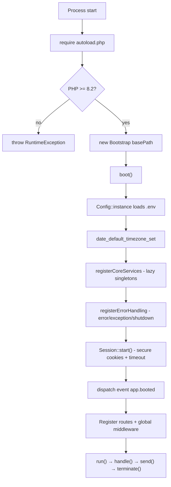
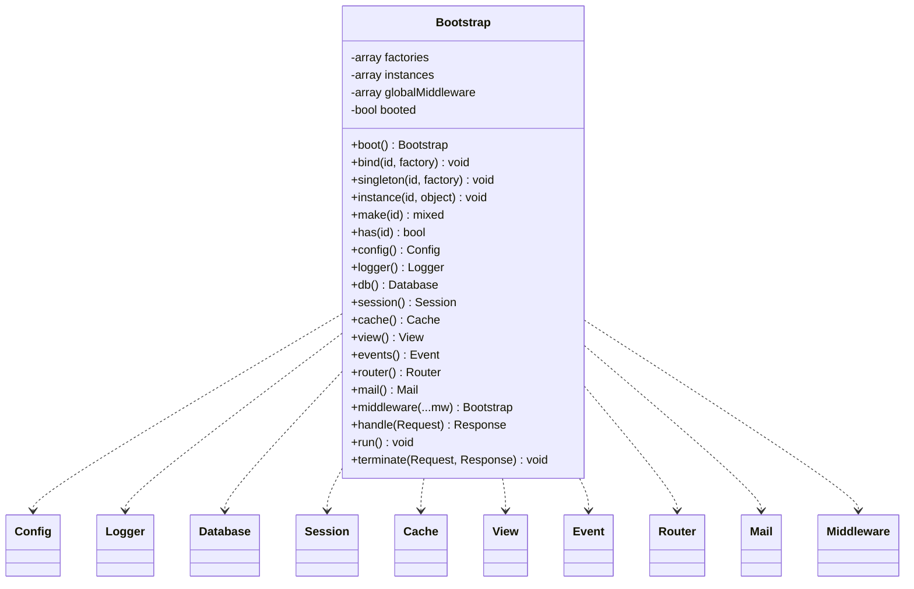
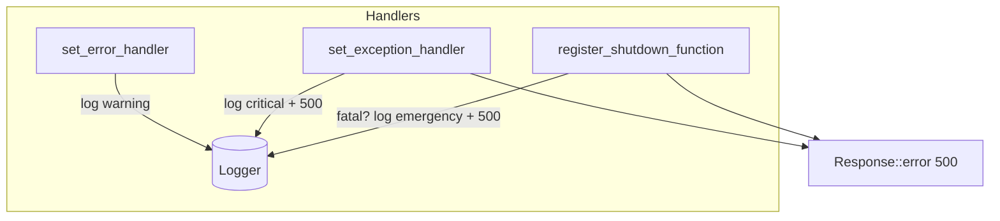

# Application Bootstrap

How a DMF application starts up: the `DMF\Core\Bootstrap` kernel, its service
container, and the ordered steps from process start to a ready-to-serve
application.

> **Applies to template version:** `1.1.0` · **Namespace:** `DMF\Core`
> **Requires:** PHP 8.2+ · **Last updated:** 2026-07-14

`Bootstrap` is the composition root. It wires the existing Core Framework
classes together — it does not replace or modify them — and drives the request
lifecycle documented in [LIFECYCLE.md](./LIFECYCLE.md).

---

## Table of Contents

1. [Role of Bootstrap](#role-of-bootstrap)
2. [The Front Controller](#the-front-controller)
3. [Startup Lifecycle](#startup-lifecycle)
4. [Boot Steps in Detail](#boot-steps-in-detail)
5. [The Service Container](#the-service-container)
6. [Registered Services](#registered-services)
7. [Global Middleware](#global-middleware)
8. [Error, Exception & Shutdown Handling](#error-exception--shutdown-handling)
9. [Lifecycle Events](#lifecycle-events)
10. [Full Example](#full-example)
11. [Cross References](#cross-references)

---

## Role of Bootstrap

| Responsibility | Method |
| -------------- | ------ |
| Load configuration + environment | `boot()` → `Config::instance()` |
| Set timezone | `boot()` |
| Register error/exception/shutdown handlers | `boot()` |
| Register Core services (lazy singletons) | `boot()` |
| Start the secure session | `boot()` → `Session::start()` |
| Resolve services | `make()` + typed accessors (`db()`, `cache()`, …) |
| Run the request | `run()` → `handle()` → `terminate()` |

Everything is **composition**: the container only ever constructs existing Core
classes and hands them their dependencies.

---

## The Front Controller

A single entry file (`public_html/index.php`) creates the kernel and runs it:

```php
<?php
declare(strict_types=1);

require_once __DIR__ . '/../includes/Core/autoload.php';

use DMF\Core\{Bootstrap, Request, Response};

$app = new Bootstrap(dirname(__DIR__));
$app->boot();

// Register routes (or require a routes file that receives $app).
$app->router()->get('/', fn(Request $r) => Response::html('<h1>DMF</h1>'))->name('home');

$app->run();
```

---

## Startup Lifecycle



---

## Boot Steps in Detail

| # | Step | What happens |
| - | ---- | ------------ |
| 1 | **Autoload + version guard** | `autoload.php` registers the `DMF\Core\` PSR-4 loader and throws if PHP < 8.2. |
| 2 | **Config** | `Config::instance($basePath)` parses `.env` and seeds the config store. Cached as the `config` singleton. |
| 3 | **Timezone** | `date_default_timezone_set(TIMEZONE)` (default `Asia/Bangkok`). |
| 4 | **Service registration** | Every Core service is registered as a **lazy** singleton — no I/O yet (the DB does not connect until first used). |
| 5 | **Error handling** | Installs `set_error_handler`, `set_exception_handler`, and `register_shutdown_function`, all routing through the `Logger`. |
| 6 | **Session** | `Session::start()` applies hardened cookie params, enforces the idle timeout, and ages flash messages. |
| 7 | **`app.booted` event** | Listeners can perform app-specific wiring after the framework is ready. |

`boot()` is idempotent — calling it twice is a no-op after the first run.

---

## The Service Container

A deliberately tiny container: no reflection, no auto-wiring, no packages.



| Method | Behavior |
| ------ | -------- |
| `bind($id, $factory)` | Factory re-invoked on **every** `make()` (non-shared). |
| `singleton($id, $factory)` | Factory invoked once; result cached (shared). |
| `instance($id, $obj)` | Register an already-built object. |
| `make($id)` | Resolve a service (throws if unknown). |
| `has($id)` | Is a service registered? |

Typed accessors (`config()`, `db()`, `cache()`, …) wrap `make()` and guarantee
the concrete return type, so calling code stays fully type-safe.

Override a service before/after boot by re-binding it:

```php
$app->singleton('cache', fn() => new DMF\Core\Cache('/dev/shm/app-cache'));
```

---

## Registered Services

| Id | Class | Constructed from Config |
| -- | ----- | ----------------------- |
| `config` | `Config` | `.env` at `$basePath` |
| `logger` | `Logger` | `LOG_PATH`, `LOG_LEVEL`, `LOG_CHANNEL` |
| `db` | `Database` | `DB_HOST/PORT/DATABASE/USERNAME/PASSWORD` (lazy connect) |
| `session` | `Session` | `SESSION_TIMEOUT` |
| `cache` | `Cache` | `CACHE_PATH` |
| `view` | `View` | `VIEW_PATH` |
| `events` | `Event` | — |
| `router` | `Router` | — |
| `mail` | `Mail` | `MAIL_HOST/PORT/USERNAME/PASSWORD/ENCRYPTION/FROM` |

All are singletons: `$app->router() === $app->router()`.

---

## Global Middleware

Middleware registered on the kernel wrap **every** request, outermost first,
before the router runs (see [Middleware](./CLASS_DIAGRAM.md#the-classes) and
[LIFECYCLE.md](./LIFECYCLE.md#3-middleware-pipeline)):

```php
$app->middleware(
    new App\Middleware\ForceHttps(),          // a class extending DMF\Core\Middleware
    function (Request $req, callable $next) {  // or a plain callable
        return $next($req);
    }
);
```

Per-route middleware are attached on the router instead:
`$app->router()->get(...)->middleware(...)`.

---

## Error, Exception & Shutdown Handling

`registerErrorHandling()` installs three safety nets, all logging through the
shared `Logger` and never leaking internals when `APP_DEBUG=false`:



- **Errors** (notices/warnings) → logged; PHP's `display_errors` governs display
  (`On` only when `APP_DEBUG=true`).
- **Uncaught exceptions** → logged `critical`; a safe `500` is sent.
- **Fatal errors** (shutdown) → logged `emergency`; a safe `500` is sent if
  headers are not yet sent.

Inside `handle()`, any `Throwable` thrown by middleware or a controller is also
caught and converted to a logged `500` — so a single bad request never takes the
process down.

---

## Lifecycle Events

`Bootstrap` dispatches these via the `Event` service; register listeners with
`$app->events()->listen(...)`:

| Event | Payload | When |
| ----- | ------- | ---- |
| `app.booted` | `Bootstrap` | After `boot()` completes. |
| `request.received` | `Request` | Start of `handle()`. |
| `response.prepared` | `Response` | End of `handle()`, before send. |
| `app.terminating` | `['request'=>…, 'response'=>…]` | In `terminate()`, after send. |

---

## Full Example

```php
<?php
declare(strict_types=1);

require_once __DIR__ . '/../includes/Core/autoload.php';

use DMF\Core\{Bootstrap, Request, Response};

$app = new Bootstrap(dirname(__DIR__));
$app->boot();

// Cross-cutting concerns as global middleware.
$app->middleware(function (Request $req, callable $next): Response {
    $res = $next($req);
    return $res->header('X-Frame-Options', 'SAMEORIGIN');
});

// Observe the lifecycle.
$app->events()->listen('app.terminating', function (array $ctx) use ($app): void {
    $app->logger()->info('Served {path}', ['path' => $ctx['request']->path()]);
});

// Routes.
$app->router()->get('/', fn(Request $r) => Response::html('<h1>Welcome</h1>'))->name('home');
$app->router()->get('/health', fn(Request $r) => Response::success(['status' => 'ok']))->name('health');

// Serve.
$app->run();
```

---

## Cross References

- [LIFECYCLE.md](./LIFECYCLE.md) — request → response → shutdown flow
- [CLASS_DIAGRAM.md](./CLASS_DIAGRAM.md) — the full Core class map
- [ARCHITECTURE.md](./ARCHITECTURE.md) — where the framework sits in the stack
- [SECURITY.md](./SECURITY.md) — session, headers, and error-leak policy
- [INSTALL.md](./INSTALL.md) — environment variables consumed at boot

---

<sub>DMF PHP Template · Application Bootstrap · v1.1.0 · © 2026 Digital Media Foundation</sub>
