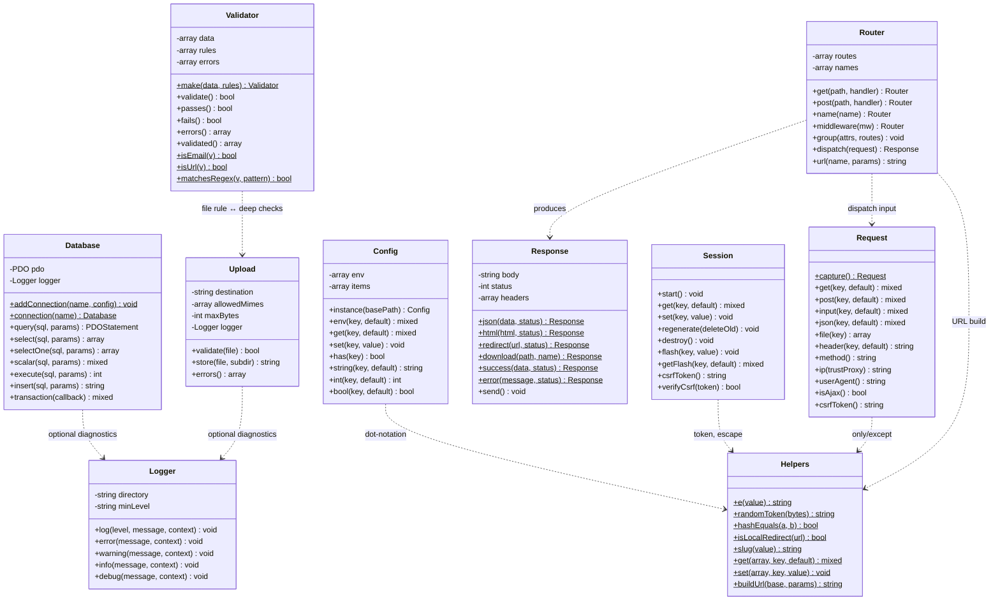
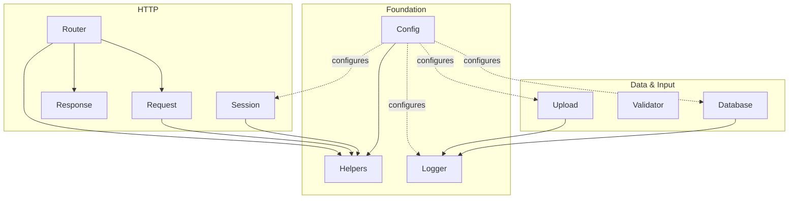
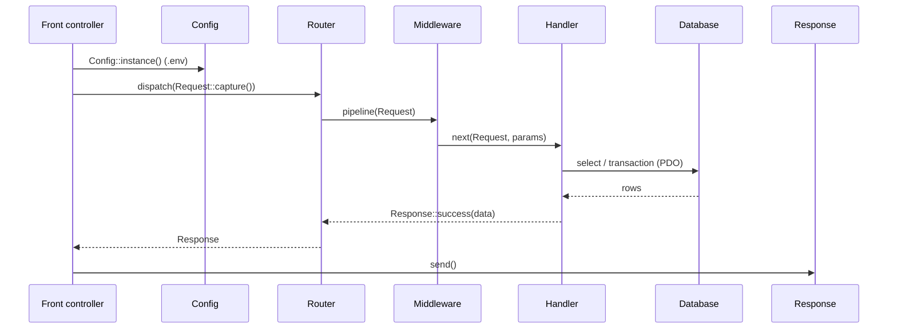

# DMF Core Framework — Class Diagram & Reference

The reusable object layer under `includes/Core/` — ten dependency-free classes
that form the shared foundation of every DMF PHP application
(projects, timetable, library, inventory, grade, health).

> **Applies to template version:** `1.1.0` · **Namespace:** `DMF\Core`
> **Requires:** PHP 8.2+ · **Last updated:** 2026-07-14

Extracted from the canonical implementation (`projects.dmf.ac.th`) as pure
architecture: **no business logic, no Composer packages, no framework.**

---

## Table of Contents

1. [Overview](#overview)
2. [Class Diagram](#class-diagram)
3. [Dependency Graph](#dependency-graph)
4. [The Classes](#the-classes)
   - [Config](#config) · [Database](#database) · [Request](#request) · [Response](#response) · [Session](#session)
   - [Logger](#logger) · [Validator](#validator) · [Upload](#upload) · [Helpers](#helpers) · [Router](#router)
5. [Relationships](#relationships)
6. [Bootstrapping](#bootstrapping)
7. [Request Lifecycle](#request-lifecycle)
8. [Design Rules](#design-rules)
9. [Cross References](#cross-references)

---

## Overview

| Class | File | One-line responsibility |
| ----- | ---- | ----------------------- |
| `Config` | `Config.php` | Environment loader + dot-notation configuration store. |
| `Database` | `Database.php` | Shared PDO, pooled named connections, transactions, prepared statements. |
| `Request` | `Request.php` | Immutable view of the current HTTP request. |
| `Response` | `Response.php` | Build & emit JSON/HTML/redirect/download responses. |
| `Session` | `Session.php` | Secure session, flash messages, CSRF storage, idle timeout. |
| `Logger` | `Logger.php` | PSR-3 inspired daily-rotating file logger. |
| `Validator` | `Validator.php` | Rule-based input validation with reusable predicates. |
| `Upload` | `Upload.php` | Secure file uploads: MIME/extension/size/random-name/containment. |
| `Helpers` | `Helpers.php` | Stateless security/string/array/date/URL utilities. |
| `Router` | `Router.php` | Named routes, middleware pipeline, reverse URL generation. |

An `autoload.php` provides a PSR-4 autoloader for the `DMF\Core\` namespace and
enforces the PHP 8.2 floor — the only glue needed to run without Composer.

---

## Class Diagram



> Static members are marked with `$`. Dotted arrows (`..>`) denote a *uses*
> dependency, not inheritance — the framework is composition-only, with no base
> classes or interfaces to keep it dependency-free.

---

## Dependency Graph



`Helpers`, `Config`, and `Logger` are the leaves everything else can lean on;
nothing depends on the HTTP or data classes, so any subset can be used
independently (e.g. a CLI script using only `Config` + `Database` + `Logger`).

---

## The Classes

### Config
Loads `.env` (dependency-free parser with `true/false/null` coercion) and
doubles as an in-memory configuration store addressable by `dot.notation`. It is
the single source of truth the other components read their settings from. Typed
getters (`int`, `bool`, `string`) fall back from the config tree to environment
values. Uses `Helpers::get/set/has` for dot traversal.

### Database
Wraps one PDO instance with the platform standard (`ERRMODE_EXCEPTION`,
`FETCH_ASSOC`, `EMULATE_PREPARES = false`). Provides `select`, `selectOne`,
`scalar`, `execute`, `insert`, and a `transaction(callable)` wrapper that
commits on success and rolls back on any throwable. **Connection-pool ready:**
`addConnection(name, config)` registers configs and `connection(name)`
instantiates lazily into a static pool, so multiple databases coexist without
global coupling. Connection failures fail closed (generic message) and are
logged if a `Logger` was supplied.

### Request
An immutable snapshot of the HTTP request, built from the superglobals via
`capture()` or from arrays in tests. Exposes GET/POST/merged input, JSON body
decoding, uploaded files, case-insensitive headers, method helpers, `isAjax()`,
client `ip()` (proxy-aware only when explicitly trusted), `userAgent()`, and the
client-supplied CSRF token. Consumed by `Router` and `Validator`.

### Response
A chainable builder accumulating status, headers, and body, emitted once via
`send()`. Static factories cover `json`, `html`, `text`, `redirect`, `download`
(streamed), and `noContent`, plus `success()`/`error()` which render the
platform's documented JSON envelope (`{ success, data | message, errors }`).
`Router` handlers return a `Response`.

### Session
Starts sessions with hardened cookie params (HttpOnly, SameSite, Secure,
strict-mode), enforces an idle timeout, and regenerates ids on demand. Adds
one-request **flash messages** and **CSRF** token storage/verification. Uses
`Helpers::randomToken()` for tokens and `Helpers::e()` for the hidden field.

### Logger
PSR-3 *inspired* (same eight levels and `{placeholder}` interpolation) without
the `psr/log` dependency. Writes one file per day —
`<directory>/<channel>-YYYY-MM-DD.log` — with a configurable minimum level and
JSON-encoded context. Injected optionally into `Database` and `Upload`.

### Validator
Validates a data array against pipe-string or array rules (`required`, `email`,
`url`, `integer`, `float`, `numeric`, `string`, `boolean`, `length`, `min`,
`max`, `between`, `regex`, `in`, `file`) and collects per-field messages. Every
rule is also a static predicate (`isEmail`, `isUrl`, `isInteger`,
`matchesRegex`, …) for one-off checks. Its `file` rule pairs with `Upload` for
deep file inspection.

### Upload
Enforces upload safety before a file touches disk: real MIME detection via
`finfo`, extension allow-listing, a size ceiling, a random server-side filename,
and destination-directory containment (defeats `../` traversal via `realpath`).
`validate()` pre-checks; `store()` validates then moves and returns the stored
relative path, throwing on failure.

### Helpers
Pure, static, deterministic utilities in five groups — **security** (`e`,
`randomToken`, `hashEquals`, `isLocalRedirect`), **string** (`slug`, `limit`,
`snake`, `camel`, `mask`, `randomString`), **array** (dot `get`/`set`/`has`,
`only`, `except`, `pluck`), **date** (`now`, `isoNow`, `formatDate`), and
**URL** (`buildUrl`, `currentUrl`). The shared toolbox other classes reuse.

### Router
An explicit router for apps that prefer it over file-based routing. Registers
named routes with `{param}` / `{param:regex}` placeholders, supports global,
group, and per-route middleware (`fn(Request, next): Response`), dispatches a
`Request` to a handler, and generates URLs from names via `url()`. Returns
`404`/`405` responses automatically. Kept to a single class via
post-registration chaining (`->name()->middleware()`).

---

## Relationships

| From | To | Kind | Why |
| ---- | -- | ---- | --- |
| `Config` | `Helpers` | uses | dot-notation traversal of the config tree |
| `Session` | `Helpers` | uses | CSRF token generation + field escaping |
| `Request` | `Helpers` | uses | `only()` / `except()` input filtering |
| `Router` | `Helpers` | uses | reverse-URL query building |
| `Router` | `Request` | consumes | matches the request path/method |
| `Router` | `Response` | produces | handlers/middleware return responses |
| `Database` | `Logger` | optional | logs connection/query/transaction failures |
| `Upload` | `Logger` | optional | logs rejected uploads |
| `Validator` | `Upload` | pairs | `file` rule ↔ deep MIME/size validation |
| `Config` | `Database`/`Session`/`Logger`/`Upload` | configures | supplies their settings at wiring time |

There is **no inheritance** anywhere — all collaboration is by composition and
constructor injection, so classes stay individually testable and swappable.

---

## Bootstrapping

Wire the framework once during application start-up:

```php
<?php
declare(strict_types=1);

require_once __DIR__ . '/../includes/Core/autoload.php';

use DMF\Core\{Config, Database, Logger, Session, Request, Response, Router};

// 1. Configuration (loads .env)
$config = Config::instance(__DIR__ . '/..');

// 2. Logger → storage/logs/
$logger = new Logger($config->string('LOG_PATH', __DIR__ . '/../storage/logs'));

// 3. Database (pool-ready)
Database::addConnection('default', [
    'host'     => $config->string('DB_HOST', '127.0.0.1'),
    'port'     => $config->string('DB_PORT', '3306'),
    'database' => $config->string('DB_DATABASE'),
    'username' => $config->string('DB_USERNAME'),
    'password' => $config->string('DB_PASSWORD'),
]);
$db = Database::connection('default', $logger);

// 4. Secure session
$session = new Session($config->int('SESSION_TIMEOUT', 1800));
$session->start();

// 5. Route and dispatch
$router = new Router();
$router->get('/health', fn(Request $r) => Response::success(['status' => 'ok']))->name('health');

$router->dispatch(Request::capture())->send();
```

---

## Request Lifecycle



---

## Design Rules

| Rule | Enforced by |
| ---- | ----------- |
| PHP 8.2+ | `autoload.php` version guard |
| `declare(strict_types=1)` | every file |
| PSR-12 | `.editorconfig` + PHP-CS-Fixer (see [CODING_STANDARD.md](./CODING_STANDARD.md)) |
| No Composer packages / no framework | zero `require` of `vendor/`; hand-rolled autoloader |
| No business logic | only cross-cutting infrastructure lives here |
| Composition over inheritance | no base classes/interfaces; constructor injection |
| Prepared statements only | `Database` never interpolates SQL |

---

## Cross References

- [ARCHITECTURE.md](./ARCHITECTURE.md) — where the Core layer sits in the stack
- [CODING_STANDARD.md](./CODING_STANDARD.md) — the standard these classes follow
- [DATABASE.md](./DATABASE.md) — schema & prepared-statement conventions
- [API.md](./API.md) — the JSON envelope `Response` produces
- [SECURITY.md](./SECURITY.md) — CSRF, uploads, sessions, headers
- [TESTING.md](./TESTING.md) — how to test these classes
- [ROADMAP.md](./ROADMAP.md) — planned framework capabilities

---

<sub>DMF PHP Template · Core Framework Class Diagram · v1.1.0 · © 2026 Digital Media Foundation</sub>
