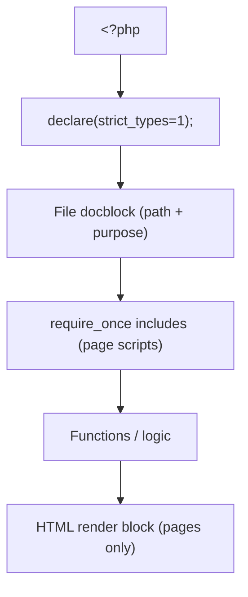
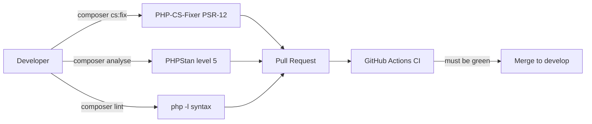

# Coding Standard

The mandatory coding convention for every application built on the
**DMF PHP Template** — PSR-12, static analysis, and security-by-default,
enforced by `.editorconfig`, PHPStan, PHP-CS-Fixer, and CI.

> **Applies to template version:** `1.1.0` · **Last updated:** 2026-07-14

This is the enterprise reference; a concise companion lives at
[docs/coding-standards.md](./docs/coding-standards.md).

---

## Table of Contents

1. [Principles](#principles)
2. [PSR-12 Baseline](#psr-12-baseline)
3. [File Layout](#file-layout)
4. [Naming Conventions](#naming-conventions)
5. [Types & Function Design](#types--function-design)
6. [Database Access](#database-access)
7. [Security-by-Default](#security-by-default)
8. [Front-end Conventions](#front-end-conventions)
9. [Documentation & Comments](#documentation--comments)
10. [Tooling & Enforcement](#tooling--enforcement)
11. [Local Verification](#local-verification)
12. [Cross References](#cross-references)

---

## Principles

| Principle | Meaning |
| --------- | ------- |
| Consistency over preference | The style below is not negotiable per-developer; the tooling decides. |
| Readability first | Small functions, explicit names, no cleverness that obscures intent. |
| Secure by default | Escaping, prepared statements, and CSRF are conventions, not options. |
| No runtime framework | Plain procedural PHP + PDO; Composer is dev-tooling only. |
| Fail loudly in dev, safely in prod | `APP_DEBUG` drives error visibility. |

---

## PSR-12 Baseline

All PHP follows [PSR-12](https://www.php-fig.org/psr/psr-12/). The non-negotiables:

- `<?php` opening tag; **no closing `?>`** in PHP-only files.
- `declare(strict_types=1);` immediately after the opening tag.
- **4-space** indentation, never tabs (enforced by `.editorconfig`).
- **LF** line endings, **UTF-8**, final newline, no trailing whitespace.
- One blank line after the `namespace`/`use` block; braces on their own line for
  functions and classes, same line for control structures.
- Soft limit ~120 columns.

```php
<?php

declare(strict_types=1);

/**
 * Return the display label for a role.
 */
function roleLabel(string $role): string
{
    return match ($role) {
        'super_admin' => 'Super Administrator',
        'admin'       => 'Administrator',
        default       => 'User',
    };
}
```

Front-end assets (JS/CSS/HTML/JSON/YAML) use **2-space** indentation per
`.editorconfig`.

---

## File Layout

Every PHP source file, in order:



Authenticated pages use the canonical include chain (see
[ARCHITECTURE.md](./ARCHITECTURE.md#request-flow)):

```php
require_once __DIR__ . '/../../includes/auth_check.php';  // session → globals
require_once __DIR__ . '/../../includes/permission.php';  // RBAC helpers
require_once __DIR__ . '/../../includes/routes.php';      // link helpers
```

---

## Naming Conventions

| Element | Convention | Example |
| ------- | ---------- | ------- |
| Function | `camelCase` (verbs) | `sendMail()`, `requireRole()` |
| Local variable | `camelCase` | `$currentUser`, `$avatarPath` |
| Global constant | `UPPER_SNAKE_CASE` | `APP_NAME`, `SESSION_TIMEOUT` |
| Constant array key (routes) | dot-namespaced | `admin.users`, `api.document.create` |
| Class (when used) | `PascalCase` | `CoreTest` |
| Test method | `test<Behavior>` | `testRouteAppendsQueryString()` |
| DB table / column | `snake_case` | `audit_logs`, `created_at` |
| File (page/include) | `snake_case.php` | `auth_check.php`, `create_document.php` |

Identifiers and code are **English**; user-facing copy may be localized per app.

---

## Types & Function Design

- Declare parameter and return types on every function; use union/nullable types
  where honest (`string|int|bool|null`, `?array`).
- Prefer pure helpers with no hidden side effects; functions that touch the DB
  take `PDO $conn` (or use the shared global explicitly and document it).
- Keep functions short and single-purpose. Guard-clause early returns over deep
  nesting.
- Use `match` over long `switch` where exhaustive.

```php
/**
 * @param array<string,mixed> $user
 */
function requireRole(array $user, string ...$roles): void
{
    requirePermission(hasRole((string) ($user['role'] ?? ''), ...$roles));
}
```

---

## Database Access

**The only permitted pattern is a PDO prepared statement with positional
parameters.** No string-built SQL, ever.

```php
// ✅
$stmt = $conn->prepare('SELECT id, name FROM users WHERE role = ? AND is_active = 1');
$stmt->execute([$role]);
$rows = $stmt->fetchAll();

// ❌ never
// $conn->query("SELECT * FROM users WHERE role = '$role'");
```

- Reuse the single shared `$conn`; never open extra connections.
- Wrap multi-step writes in `beginTransaction()` / `commit()` / `rollBack()`.
- Full detail: [DATABASE.md](./DATABASE.md#database-conventions).

---

## Security-by-Default

These are conventions, not choices — see [SECURITY.md](./SECURITY.md).

- Escape **all** output with `htmlspecialchars($v, ENT_QUOTES, 'UTF-8')`.
- Protect every state-changing POST with `csrf_field()` / `csrf_require()`.
- Never interpolate user input into SQL, shell, or HTML.
- Never commit secrets — read configuration via `env()` from `.env`.
- Constrain redirects to local paths (`/...`, reject `//host`).
- Gate privileged actions with `requirePermission()` / `requireRole()`.

---

## Front-end Conventions

- No build step. Each page owns its inline `<style>` / `<script>`.
- Use the shared design tokens (CSS variables):
  `--primary:#1e3a8a; --bg:#f1f5fb; --surface:#fff; --border:#e2e8f0; --text:#1e293b; --muted:#64748b`.
- CDN dependencies only (Bootstrap 5.3, Font Awesome 6.4, Sarabun font).
- Vanilla JS — no jQuery, no bundlers.

---

## Documentation & Comments

- Every file starts with a docblock stating its path and purpose.
- Public/reusable functions carry PHPDoc with `@param` / `@return`, especially
  array shapes (`@param array<string,mixed> $user`) so PHPStan can reason.
- Comment the *why*, not the *what*. Delete commented-out code — Git is history.

---

## Tooling & Enforcement



| Tool | Config | Enforces |
| ---- | ------ | -------- |
| EditorConfig | `.editorconfig` | Indentation, charset, EOL, final newline. |
| PHP-CS-Fixer | `composer cs` / `cs:fix` | PSR-12 formatting. |
| PHPStan | `phpstan.neon.dist` (**level 5**) | Type safety, dead code, undefined symbols. |
| `php -l` | CI matrix (8.1/8.2/8.3) | Syntax validity across supported PHP. |

PHPStan analyses `includes/`, `config/`, and `public_html/` (excludes `vendor/`,
`storage/`, `tests/`).

---

## Local Verification

Run before every push (mirrors CI — see [DEVOPS.md](./DEVOPS.md)):

```bash
composer lint       # php -l across the tree
composer analyse    # PHPStan level 5
composer test       # PHPUnit
composer cs         # PSR-12 report (composer cs:fix to auto-fix)

# all-in-one
composer check      # lint + analyse + test
```

A change is not ready for review until `composer check` is green and formatting
is clean.

---

## Cross References

- [DEVOPS.md](./DEVOPS.md) — CI/CD pipeline & developer workflow
- [TESTING.md](./TESTING.md) — testing convention
- [SECURITY.md](./SECURITY.md) — security baseline
- [DATABASE.md](./DATABASE.md#database-conventions) — data-access rules
- [ARCHITECTURE.md](./ARCHITECTURE.md) — where code lives
- [docs/coding-standards.md](./docs/coding-standards.md) — concise companion

---

<sub>DMF PHP Template · Coding Standard · v1.1.0 · © 2026 Digital Media Foundation</sub>
