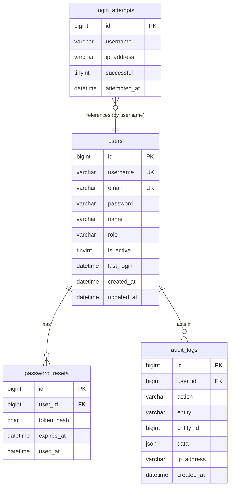
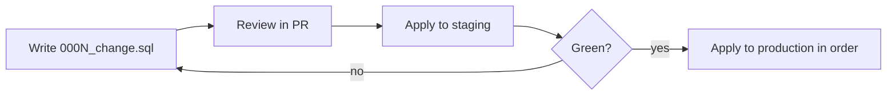
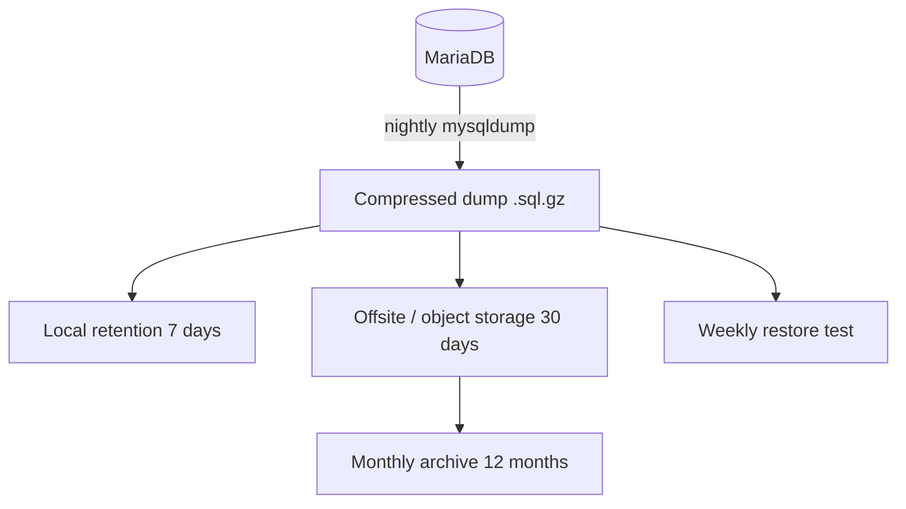

# Database Guide

Database conventions, schema standards, migration strategy, and backup policy
for applications built on the **DMF PHP Template**.

> **Applies to template version:** `1.1.0` · **Last updated:** 2026-07-14

---

## Table of Contents

1. [Platform Standard](#platform-standard)
2. [Core Schema](#core-schema)
3. [Database Conventions](#database-conventions)
4. [Naming Standards](#naming-standards)
5. [Indexes](#indexes)
6. [Foreign Keys](#foreign-keys)
7. [Migration Strategy](#migration-strategy)
8. [Seeds](#seeds)
9. [Backup Strategy](#backup-strategy)
10. [Cross References](#cross-references)

---

## Platform Standard

| Property | Value |
| -------- | ----- |
| Engine | InnoDB |
| Charset | `utf8mb4` |
| Collation | `utf8mb4_unicode_ci` |
| Server | MySQL 8.0+ / MariaDB 10.5+ |
| Access layer | PDO, prepared statements only (no ORM) |
| Time zone | `+07:00` (Asia/Bangkok) |

The template ships **only the reusable core schema** — identity,
authentication, and auditing. All domain tables belong to each application's own
numbered migrations.



---

## Core Schema

| Table | Purpose |
| ----- | ------- |
| `users` | Application accounts + role. `password` stores a bcrypt/argon hash. |
| `password_resets` | Token-based recovery; stores only the sha256 hash of the emailed token. |
| `login_attempts` | Per-username/IP attempt log for lockout / rate limiting. |
| `audit_logs` | Generic who-did-what trail with a JSON payload. |

The authoritative definitions are in
[`database/migrations/0001_core_schema.sql`](./database/migrations/0001_core_schema.sql).

---

## Database Conventions

- **Every query uses PDO prepared statements** with positional `?` parameters —
  never string interpolation. See [SECURITY.md](./SECURITY.md#sql-injection).
- One shared connection (`$conn`) created in `config/config.php`; do not open
  additional connections.
- `PDO::ATTR_EMULATE_PREPARES => false` for real server-side prepares.
- Wrap multi-step writes in transactions:

```php
$conn->beginTransaction();
try {
    $conn->prepare('INSERT INTO audit_logs (user_id, action) VALUES (?, ?)')
         ->execute([$userId, 'record.create']);
    $conn->prepare('UPDATE users SET updated_at = NOW() WHERE id = ?')
         ->execute([$userId]);
    $conn->commit();
} catch (Throwable $e) {
    $conn->rollBack();
    throw $e;
}
```

- Store timestamps as `DATETIME` defaulting to `CURRENT_TIMESTAMP`.
- Prefer soft flags (`is_active`) over hard deletes for user-facing records.

---

## Naming Standards

| Object | Convention | Example |
| ------ | ---------- | ------- |
| Table | `snake_case`, plural | `users`, `audit_logs` |
| Column | `snake_case`, singular | `created_at`, `is_active` |
| Primary key | `id` | `id BIGINT UNSIGNED AUTO_INCREMENT` |
| Foreign key column | `<singular>_id` | `user_id` |
| Foreign key constraint | `fk_<table>_<ref>` | `fk_audit_user` |
| Unique key | `uq_<table>_<col>` | `uq_users_username` |
| Index | `idx_<table>_<col>` | `idx_users_role` |
| Boolean | `is_` / `has_` prefix | `is_active` |
| Timestamp | `_at` suffix | `expires_at`, `used_at` |

- SQL keywords uppercase; identifiers lowercase and backtick-quoted.
- Every table has an `id BIGINT UNSIGNED AUTO_INCREMENT` primary key.

---

## Indexes

Guidelines:

- Index every foreign key column.
- Index columns used in `WHERE`, `JOIN`, and `ORDER BY` on hot paths.
- Use composite indexes in the order of query selectivity, e.g.
  `idx_audit_entity (entity, entity_id)`.
- Enforce uniqueness with unique indexes (`uq_users_username`), not application
  checks.
- Avoid over-indexing write-heavy tables (`login_attempts`, `audit_logs`) — each
  index costs on insert.

```sql
-- Composite index example (lookup by entity, then id)
KEY `idx_audit_entity` (`entity`, `entity_id`),
-- Time-range pruning for rate limiting
KEY `idx_la_time` (`attempted_at`)
```

---

## Foreign Keys

- Declared explicitly with `ON DELETE` semantics chosen per relationship:

| Relationship | Rule | Rationale |
| ------------ | ---- | --------- |
| `password_resets.user_id → users.id` | `ON DELETE CASCADE` | Reset tokens are meaningless without their user. |
| `audit_logs.user_id → users.id` | `ON DELETE SET NULL` | Preserve the audit trail even after a user is removed. |

- Foreign key + referenced column must share type and collation.
- Name constraints `fk_<table>_<ref>` so migrations can drop them predictably.

```sql
CONSTRAINT `fk_pr_user`
    FOREIGN KEY (`user_id`) REFERENCES `users` (`id`) ON DELETE CASCADE
```

---

## Migration Strategy

Migrations are **plain, ordered `.sql` files** — no framework, matching the
no-dependency runtime.

```
database/migrations/
├── 0001_core_schema.sql      ← shipped with the template
├── 0002_add_<feature>.sql    ← your application's tables
└── 0003_alter_<feature>.sql
```

Rules:

1. **Never edit a migration that has been applied anywhere.** Add a new file.
2. Number sequentially with a zero-padded prefix (`0001_`, `0002_`, …).
3. Name after the change: `0002_add_documents_table.sql`,
   `0003_add_index_documents_owner.sql`.
4. Each file is idempotent-friendly where possible (`CREATE TABLE IF NOT EXISTS`).
5. Keep DDL and destructive changes separate from data migrations.



Apply in order:

```bash
for f in database/migrations/*.sql; do
  mysql -u dmf_app -p dmf_app < "$f"
done
```

> A lightweight `schema_migrations` tracking table is on the roadmap
> (see [ROADMAP.md](./ROADMAP.md)). Until then, track applied files in your
> deployment log.

---

## Seeds

Seeds live in `database/seeds/` and provide the minimum data for a usable
install (e.g. the initial admin account in
[`0001_seed.sql`](./database/seeds/0001_seed.sql)).

- Seeds must be **idempotent** (`ON DUPLICATE KEY UPDATE` / `INSERT IGNORE`).
- Never seed real credentials — generate hashes with
  `php -r "echo password_hash('...', PASSWORD_BCRYPT);"`.
- Keep production and development seeds separate if they diverge.

---

## Backup Strategy



**Policy:**

| Tier | Frequency | Retention |
| ---- | --------- | --------- |
| Full logical dump | Nightly | 7 days local |
| Offsite copy | Nightly | 30 days |
| Monthly archive | Monthly | 12 months |
| Restore drill | Weekly | verify latest dump restores cleanly |

Nightly dump (single-transaction, no table locks on InnoDB):

```bash
#!/usr/bin/env bash
set -euo pipefail
STAMP="$(date +%F_%H%M)"
DEST="/backups/dmf_app"
mkdir -p "$DEST"

mysqldump \
  --single-transaction --quick --routines --triggers \
  --default-character-set=utf8mb4 \
  -u backup_user -p"$DB_PASSWORD" dmf_app \
  | gzip -9 > "$DEST/dmf_app_${STAMP}.sql.gz"

# prune local copies older than 7 days
find "$DEST" -name '*.sql.gz' -mtime +7 -delete
```

Restore:

```bash
gunzip < /backups/dmf_app/dmf_app_2026-07-14_0200.sql.gz \
  | mysql -u dmf_app -p dmf_app
```

**Also back up:**

- `.env` (store securely, encrypted — it holds all secrets).
- `storage/uploads/` and `public_html/uploads/` (user-generated files).

**Retention & recovery targets:** RPO 24h (nightly), RTO ≤ 1h for a single-DB
restore. Test restores weekly — an untested backup is not a backup.

---

## Cross References

- [INSTALL.md](./INSTALL.md#database-setup) — importing schema & seeds
- [ARCHITECTURE.md](./ARCHITECTURE.md#database-layer) — how `$conn` fits the layers
- [SECURITY.md](./SECURITY.md#sql-injection) — prepared-statement policy
- [API.md](./API.md) — how data surfaces through endpoints
- [ROADMAP.md](./ROADMAP.md) — planned migration runner

---

<sub>DMF PHP Template · Database Guide · v1.1.0 · © 2026 Digital Media Foundation</sub>
