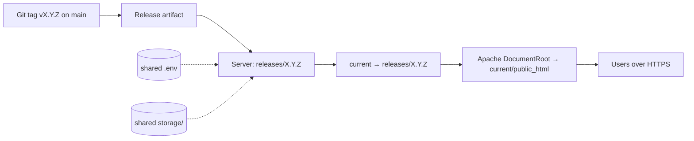
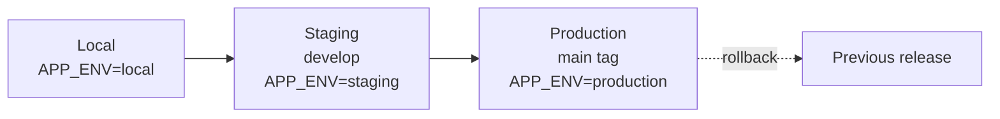
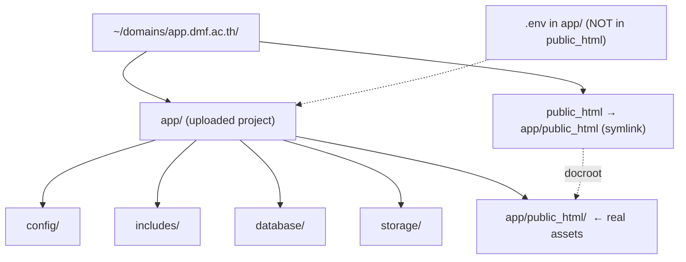
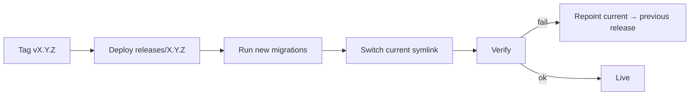
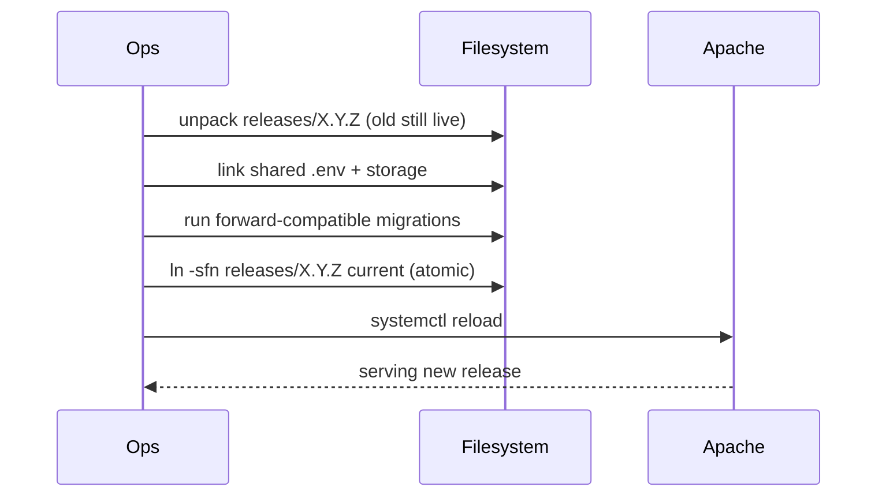

# Deployment Guide

Release and deployment operations for the **DMF PHP Template** — environment
promotion, Apache and DirectAdmin hosting, release/rollback, and zero-downtime
strategy.

> **Applies to template version:** `1.1.0` · **Last updated:** 2026-07-14

This guide covers *operating* deployments. For first-time provisioning
(requirements, `.env`, schema import), see [INSTALL.md](./INSTALL.md).

---

## Table of Contents

1. [Deployment Model](#deployment-model)
2. [Promotion Flow](#promotion-flow)
3. [Apache Configuration](#apache-configuration)
4. [DirectAdmin Deployment](#directadmin-deployment)
5. [Release & Rollback](#release--rollback)
6. [Zero-Downtime Deployment](#zero-downtime-deployment)
7. [Configuration & Secrets](#configuration--secrets)
8. [Database Migrations on Deploy](#database-migrations-on-deploy)
9. [Post-Deployment Verification](#post-deployment-verification)
10. [Cross References](#cross-references)

---

## Deployment Model

The runtime has **no build step**: deploying is placing files, pointing Apache
at `public_html/`, and configuring `.env`. Composer runs only to install dev
tooling on CI and (optionally) autoload during builds.



**Invariants (all environments):**

- Document root = `public_html/` only; `config/`, `includes/`, `database/`,
  `storage/` stay above the web root.
- `.env` lives at the project root, outside `public_html/`.
- `storage/` is the only web-server-writable tree.
- HTTPS enforced; HSTS enabled once TLS is active.

---

## Promotion Flow



| Environment | Branch/ref | `APP_DEBUG` | Gate to promote |
| ----------- | ---------- | ----------- | --------------- |
| Local | working branch | `true` | `composer check` green |
| Staging | `develop` | `false` | CI green + smoke test |
| Production | `main` (tagged `vX.Y.Z`) | `false` | Release approved (see [DEVOPS.md](./DEVOPS.md#release-strategy)) |

---

## Apache Configuration

Enable the modules the template's `.htaccess` files rely on:

```bash
a2enmod headers rewrite ssl
systemctl restart apache2
```

Production virtual host (HTTPS):

```apache
<VirtualHost *:443>
    ServerName app.dmf.ac.th
    DocumentRoot /var/www/app/current/public_html

    <Directory /var/www/app/current/public_html>
        AllowOverride All
        Require all granted
    </Directory>

    SSLEngine on
    SSLCertificateFile    /etc/ssl/certs/app.dmf.ac.th.crt
    SSLCertificateKeyFile /etc/ssl/private/app.dmf.ac.th.key

    ErrorLog  ${APACHE_LOG_DIR}/app_error.log
    CustomLog ${APACHE_LOG_DIR}/app_access.log combined
</VirtualHost>

# Redirect HTTP → HTTPS
<VirtualHost *:80>
    ServerName app.dmf.ac.th
    Redirect permanent / https://app.dmf.ac.th/
</VirtualHost>
```

The shipped `public_html/.htaccess` applies security headers, blocks dotfiles,
and disables directory listing; `public_html/uploads/.htaccess` disables script
execution. See [SECURITY.md](./SECURITY.md#security-headers).

---

## DirectAdmin Deployment

DirectAdmin is the standard shared-hosting panel across DMF deployments. The
account serves `~/domains/<domain>/public_html`, but the template needs its files
**above** that folder.



Steps:

1. Upload the project to `~/domains/app.dmf.ac.th/app/` (outside the served
   folder).
2. Set the **Document Root** to `app/public_html` in **Domain Setup**. If the
   panel forbids a custom docroot, symlink it:

   ```bash
   cd ~/domains/app.dmf.ac.th
   rm -rf public_html
   ln -s app/public_html public_html
   ```

3. Create the DB + user under **MySQL Management**; import
   `database/migrations/*.sql` (see [DATABASE.md](./DATABASE.md#migration-strategy)).
4. Place `.env` in `app/` (never inside `public_html`); set
   `APP_ENV=production`, `APP_DEBUG=false`.
5. Select PHP **8.1+** under **PHP Selector** and enable `pdo_mysql`, `openssl`,
   `mbstring`.
6. `chmod -R 775 app/storage`.
7. Install a Let's Encrypt certificate under **SSL Certificates**, enable **Force
   HTTPS**, then uncomment the HSTS header in `public_html/.htaccess`.

For an upgrade on DirectAdmin, upload the new release to `app_new/`, repoint the
`public_html` symlink, then remove the old folder (see rollback below).

---

## Release & Rollback



**Release (symlinked releases):**

```bash
APP=/var/www/app
VER=1.2.0
mkdir -p "$APP/releases/$VER"
rsync -av --exclude='.git' --exclude='.env' ./ "$APP/releases/$VER/"

# link shared, environment-specific state
ln -sfn "$APP/shared/.env"     "$APP/releases/$VER/.env"
ln -sfn "$APP/shared/storage"  "$APP/releases/$VER/storage"

# atomic switch
ln -sfn "$APP/releases/$VER" "$APP/current"
systemctl reload apache2
```

**Rollback** — repoint to the prior release (fast, because the old tree is still
present):

```bash
ln -sfn /var/www/app/releases/1.1.0 /var/www/app/current
systemctl reload apache2
```

> Roll back **code** freely. Roll back **database** only via a compensating
> forward migration or a verified backup restore — never assume a migration is
> reversible. See [DATABASE.md](./DATABASE.md#backup-strategy).

---

## Zero-Downtime Deployment

The atomic `current` symlink swap gives near-zero downtime: Apache serves the old
release until the instant the symlink flips, then serves the new one on reload.



Rules for true zero-downtime:

- Migrations must be **backward-compatible** with the currently running code
  (add columns/tables before code needs them; drop only after the old code is
  gone — expand/contract).
- Keep shared `storage/` and `.env` outside the release directory so they
  survive swaps.
- Retain the last few releases for instant rollback; prune older ones.

---

## Configuration & Secrets

- One git-ignored `.env` per environment, stored in `shared/` and symlinked into
  each release — never committed, never inside `public_html/`.
- Production: `APP_ENV=production`, `APP_DEBUG=false` so errors are logged, not
  shown.
- Rotate any credential that has ever touched git history.
- Full policy: [SECURITY.md](./SECURITY.md#secrets-management).

---

## Database Migrations on Deploy

Apply new migrations in order **before** switching the symlink (with
expand/contract to stay compatible with the live release):

```bash
for f in releases/1.2.0/database/migrations/*.sql; do
  mysql -u dmf_app -p dmf_app < "$f"
done
```

Take a fresh backup immediately before any migration:

```bash
mysqldump --single-transaction --quick --routines --triggers \
  -u backup_user -p dmf_app | gzip > /backups/pre_deploy_$(date +%F_%H%M).sql.gz
```

Conventions and backup detail: [DATABASE.md](./DATABASE.md).

---

## Post-Deployment Verification

- [ ] `https://<domain>/` redirects to login; login works.
- [ ] `APP_ENV=production`, `APP_DEBUG=false` (no stack traces on error).
- [ ] `curl -I https://<domain>/` shows security headers (`X-Content-Type-Options`, `X-Frame-Options`, HSTS).
- [ ] `.env`, `.git`, and `config/` are **not** reachable over HTTP (expect 403/404).
- [ ] Uploads directory rejects `.php` execution.
- [ ] New migrations applied; smoke-test a core workflow.
- [ ] Previous release retained for rollback.
- [ ] Error and access logs are clean.

---

## Cross References

- [INSTALL.md](./INSTALL.md) — first-time provisioning & requirements
- [DEVOPS.md](./DEVOPS.md) — CI/CD, versioning, release strategy
- [DATABASE.md](./DATABASE.md#backup-strategy) — migrations & backups
- [SECURITY.md](./SECURITY.md) — headers, secrets, hardening
- [ARCHITECTURE.md](./ARCHITECTURE.md#deployment-diagram) — deployment topology

---

<sub>DMF PHP Template · Deployment Guide · v1.1.0 · © 2026 Digital Media Foundation</sub>
