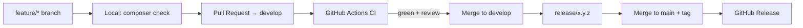
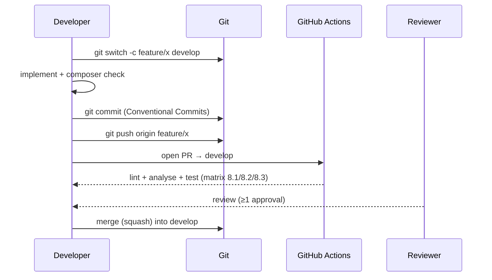
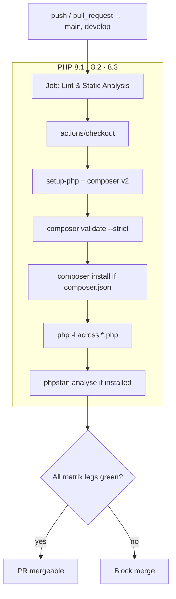

# DevOps Guide

Continuous integration, developer workflow, quality gates, versioning, and
release strategy for the **DMF PHP Template**.

> **Applies to template version:** `1.1.0` · **Last updated:** 2026-07-14

---

## Table of Contents

1. [Overview](#overview)
2. [Toolchain](#toolchain)
3. [Developer Workflow](#developer-workflow)
4. [Branch Strategy](#branch-strategy)
5. [Commit Convention](#commit-convention)
6. [CI/CD Pipeline](#cicd-pipeline)
7. [Quality Gates](#quality-gates)
8. [Versioning](#versioning)
9. [Release Strategy](#release-strategy)
10. [Environments](#environments)
11. [Cross References](#cross-references)

---

## Overview

The template treats quality as an automated gate, not a manual step. Every change
flows through the same path: branch → local checks → PR → CI → review → merge →
release.



---

## Toolchain

| Concern | Tool | Config |
| ------- | ---- | ------ |
| Dependency mgmt (dev only) | Composer 2.x | `composer.json` |
| Syntax lint | `php -l` | `composer lint` |
| Static analysis | PHPStan (level 5) | `phpstan.neon.dist` |
| Coding standard | PHP-CS-Fixer (PSR-12) | `composer cs` / `cs:fix` |
| Tests | PHPUnit 10 | `phpunit.xml.dist` |
| CI | GitHub Actions | `.github/workflows/ci.yml` |
| Formatting | EditorConfig | `.editorconfig` |

Composer scripts (single entry points, used locally **and** in CI):

```bash
composer lint       # php -l across the tree
composer analyse    # PHPStan
composer test       # PHPUnit
composer cs         # PSR-12 report
composer cs:fix     # auto-fix formatting
composer check      # lint + analyse + test
```

---

## Developer Workflow



1. Branch from `develop` (`feature/*`, `bugfix/*`).
2. Implement; keep commits small and conventional.
3. Run `composer check` locally until green.
4. Open a PR into `develop`; fill in the PR template.
5. CI must pass and at least one reviewer must approve.
6. Merge; delete the branch.

---

## Branch Strategy

A GitHub Flow / Git Flow hybrid (full detail in
[docs/git-workflow.md](./docs/git-workflow.md)).

| Branch | Purpose | Merges into |
| ------ | ------- | ----------- |
| `main` | Production-ready, released. Protected. | — |
| `develop` | Integration for the next release. | `main` (via release) |
| `feature/*` | New features. | `develop` |
| `bugfix/*` | Non-urgent fixes. | `develop` |
| `release/*` | Stabilization + version bump. | `main` + `develop` |
| `hotfix/*` | Urgent production fixes (from `main`). | `main` + `develop` |

`main` and `develop` are protected: no direct pushes; every change lands via a
reviewed, CI-green PR.

---

## Commit Convention

[Conventional Commits](https://www.conventionalcommits.org/):

```
<type>(optional scope): <subject>
```

Types: `feat`, `fix`, `docs`, `refactor`, `test`, `chore`, `ci`, `perf`.

```
feat(auth): enforce login_attempts lockout
fix(routes): correct active-state for nested paths
ci: cache composer downloads between runs
```

Conventional history feeds changelog generation and SemVer decisions.

---

## CI/CD Pipeline

Defined in `.github/workflows/ci.yml`. Triggers on push and pull request against
`main` and `develop`, with in-progress runs on the same ref cancelled.



Key properties:

- **Matrix** across PHP `8.1`, `8.2`, `8.3` with `fail-fast: false` so every leg
  reports.
- **Concurrency** group cancels superseded runs to save minutes.
- Steps degrade gracefully (skip when `composer.json`/PHPStan absent) so the
  workflow is stable as an application grows.

> **CD note:** the base template ships CI only. Deployment is documented in
> [DEPLOYMENT.md](./DEPLOYMENT.md); wire a deploy job/environment per service
> when you adopt automated delivery.

---

## Quality Gates

A PR is mergeable only when **all** hold:

| Gate | Requirement |
| ---- | ----------- |
| Syntax | `php -l` clean on 8.1/8.2/8.3. |
| Static analysis | PHPStan level 5 with no new errors. |
| Tests | PHPUnit suite green (see [TESTING.md](./TESTING.md)). |
| Formatting | PSR-12 (PHP-CS-Fixer). |
| Review | ≥1 approval. |
| Docs | `CHANGELOG.md` updated for user-facing changes. |

---

## Versioning

[Semantic Versioning 2.0.0](https://semver.org/), single source of truth in
[`VERSION`](./VERSION).

| Segment | Increment when… |
| ------- | --------------- |
| MAJOR | Incompatible/breaking changes. |
| MINOR | Backward-compatible functionality. |
| PATCH | Backward-compatible bug fixes. |

Current: **`1.1.0`**. History in [`CHANGELOG.md`](./CHANGELOG.md) (Keep a
Changelog format); plan in [ROADMAP.md](./ROADMAP.md).

---

## Release Strategy

```mermaid
gitGraph
    commit id: "develop"
    branch release/1.2.0
    checkout release/1.2.0
    commit id: "bump VERSION 1.2.0"
    commit id: "update CHANGELOG"
    checkout main
    merge release/1.2.0 tag: "v1.2.0"
    checkout develop
    merge main
```

1. Branch `release/x.y.z` from `develop`.
2. Bump `VERSION`; move `CHANGELOG.md` `[Unreleased]` into `[x.y.z] - DATE`.
3. Open PR into `main`; ensure CI green + review.
4. Merge to `main`; tag `git tag -a vx.y.z -m "Release x.y.z" && git push --tags`.
5. Merge `main` back into `develop`.
6. Publish a GitHub Release from the tag with the changelog section.

Full mechanics: [DEPLOYMENT.md](./DEPLOYMENT.md#release--rollback) and
[docs/git-workflow.md](./docs/git-workflow.md#release-process).

---

## Environments

| Environment | `APP_ENV` | `APP_DEBUG` | Source | Purpose |
| ----------- | --------- | ----------- | ------ | ------- |
| Local | `local` | `true` | working branch | Development. |
| Staging | `staging` | `false` | `develop` | Pre-release verification. |
| Production | `production` | `false` | `main` (tagged) | Live service. |

Each environment has its own git-ignored `.env`. Never share production secrets
with lower environments. See [SECURITY.md](./SECURITY.md#secrets-management).

---

## Cross References

- [CODING_STANDARD.md](./CODING_STANDARD.md) — the standards CI enforces
- [TESTING.md](./TESTING.md) — the test gate
- [DEPLOYMENT.md](./DEPLOYMENT.md) — shipping releases
- [ROADMAP.md](./ROADMAP.md) — planned CD & tooling
- [docs/git-workflow.md](./docs/git-workflow.md) — branch/version/release detail

---

<sub>DMF PHP Template · DevOps Guide · v1.1.0 · © 2026 Digital Media Foundation</sub>
