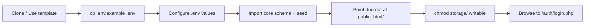
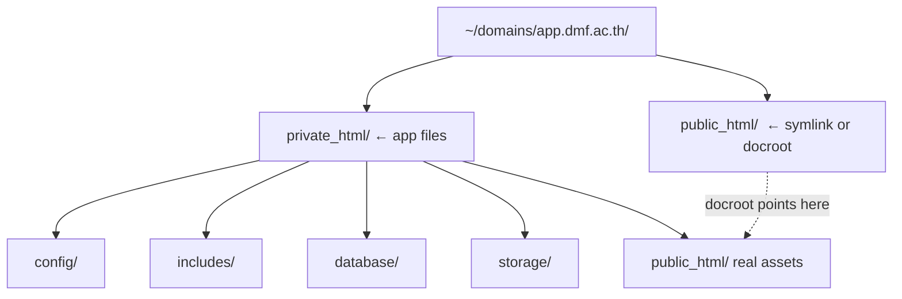
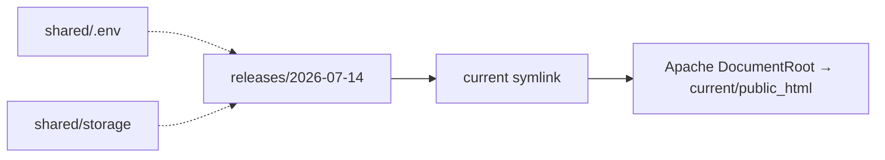

# Installation & Deployment Guide

Complete installation, configuration, and deployment reference for applications
built on the **DMF PHP Template**.

> **Applies to template version:** `1.1.0` · **Last updated:** 2026-07-14

---

## Table of Contents

1. [Overview](#overview)
2. [Requirements](#requirements)
   - [PHP](#php)
   - [Apache](#apache)
   - [MySQL / MariaDB](#mysql--mariadb)
3. [Environment Variables](#environment-variables)
4. [Local Installation](#local-installation)
   - [Windows](#windows)
   - [Linux](#linux)
5. [Database Setup](#database-setup)
6. [Production Deployment](#production-deployment)
   - [DirectAdmin](#directadmin)
   - [Generic Linux + Apache](#generic-linux--apache)
7. [Post-Installation Checklist](#post-installation-checklist)
8. [Troubleshooting](#troubleshooting)
9. [Cross References](#cross-references)

---

## Overview

The template ships a plain-procedural-PHP application with **no build step** at
runtime. Installation is therefore: provision PHP + a web server + a database,
point the document root at `public_html/`, and configure `.env`.



---

## Requirements

| Component | Minimum | Recommended |
| --------- | ------- | ----------- |
| PHP | 8.1 | 8.3 |
| Web server | Apache 2.4 | Apache 2.4 (mod_headers, mod_rewrite) |
| Database | MySQL 8.0 / MariaDB 10.5 | MariaDB 10.6+ |
| Composer | 2.x (dev tooling only) | 2.x |
| OpenSSL | enabled (for SMTP STARTTLS) | enabled |

### PHP

Required extensions:

| Extension | Purpose |
| --------- | ------- |
| `pdo_mysql` | Database access (the single shared `$conn`) |
| `openssl` | SMTP STARTTLS in `includes/mailer.php` |
| `mbstring` | UTF-8 string handling |
| `json` | API responses and audit-log payloads |
| `session` | Authentication |

Verify:

```bash
php -v                      # 8.1.0 or newer
php -m | grep -E 'pdo_mysql|openssl|mbstring'
```

Recommended `php.ini` values for production:

```ini
display_errors = Off
log_errors = On
expose_php = Off
session.cookie_httponly = 1
session.cookie_secure = 1        ; HTTPS deployments
session.use_strict_mode = 1
upload_max_filesize = 8M
post_max_size = 10M
date.timezone = Asia/Bangkok
```

### Apache

Enable the modules the template's `.htaccess` files rely on:

```bash
a2enmod headers
a2enmod rewrite
systemctl restart apache2
```

A minimal virtual host:

```apache
<VirtualHost *:443>
    ServerName app.dmf.ac.th
    DocumentRoot /var/www/app/public_html

    <Directory /var/www/app/public_html>
        AllowOverride All
        Require all granted
    </Directory>

    SSLEngine on
    SSLCertificateFile      /etc/ssl/certs/app.dmf.ac.th.crt
    SSLCertificateKeyFile   /etc/ssl/private/app.dmf.ac.th.key

    ErrorLog  ${APACHE_LOG_DIR}/app_error.log
    CustomLog ${APACHE_LOG_DIR}/app_access.log combined
</VirtualHost>
```

> **Critical:** `DocumentRoot` must point at `public_html/` — never the project
> root. `config/`, `includes/`, `database/`, and `storage/` live **above** the
> web root and must stay unreachable over HTTP. See [ARCHITECTURE.md](./ARCHITECTURE.md).

### MySQL / MariaDB

Create the database and a least-privilege user:

```sql
CREATE DATABASE dmf_app CHARACTER SET utf8mb4 COLLATE utf8mb4_unicode_ci;

CREATE USER 'dmf_app'@'localhost' IDENTIFIED BY 'a-strong-secret';
GRANT SELECT, INSERT, UPDATE, DELETE ON dmf_app.* TO 'dmf_app'@'localhost';
FLUSH PRIVILEGES;
```

> Grant only DML. Grant DDL (`CREATE`, `ALTER`, `DROP`) temporarily when running
> migrations, then revoke it.

---

## Environment Variables

All secrets and per-deployment settings live in a git-ignored `.env` file at the
project root. Copy the template and edit it:

```bash
cp .env.example .env
```

| Variable | Example | Description |
| -------- | ------- | ----------- |
| `APP_NAME` | `DMF Application` | Display name (title bars, emails). |
| `APP_ENV` | `production` | `local` \| `staging` \| `production`. |
| `APP_DEBUG` | `false` | `true` shows errors; **must be `false` in production**. |
| `APP_URL` | `https://app.dmf.ac.th` | Canonical base URL (used for asset/links). |
| `DB_HOST` | `127.0.0.1` | Database host. |
| `DB_PORT` | `3306` | Database port. |
| `DB_DATABASE` | `dmf_app` | Database name. |
| `DB_USERNAME` | `dmf_app` | Database user. |
| `DB_PASSWORD` | `********` | Database password. |
| `MAIL_HOST` | `smtp.gmail.com` | SMTP host. |
| `MAIL_PORT` | `587` | SMTP port (587 = STARTTLS). |
| `MAIL_USERNAME` | `mailer@dmf.ac.th` | SMTP username. |
| `MAIL_PASSWORD` | `********` | SMTP password / app password. |
| `MAIL_ENCRYPTION` | `tls` | `tls` \| `ssl` \| `null`. |
| `MAIL_FROM` | `no-reply@dmf.ac.th` | Envelope From address. |
| `TIMEZONE` | `Asia/Bangkok` | PHP default timezone. |
| `SESSION_TIMEOUT` | `1800` | Idle timeout in seconds. |

These are read by `includes/env.php` and exposed as constants in
`config/config.php`. **Never commit `.env`** — only `.env.example` is tracked.

---

## Local Installation

### Windows

Using XAMPP (Apache + MariaDB + PHP 8.1+):

```powershell
# 1. Clone into the XAMPP htdocs area (or anywhere)
git clone https://github.com/dmf/dmf-template-php.git C:\dmf\app
cd C:\dmf\app

# 2. Configure environment
Copy-Item .env.example .env
notepad .env

# 3. Install dev tooling (optional, for tests/static analysis)
composer install

# 4. Import schema + seed
& "C:\xampp\mysql\bin\mysql.exe" -u root dmf_app < database\migrations\0001_core_schema.sql
& "C:\xampp\mysql\bin\mysql.exe" -u root dmf_app < database\seeds\0001_seed.sql
```

Point the Apache `DocumentRoot` (in `httpd-vhosts.conf`) at
`C:\dmf\app\public_html`, restart Apache, and browse to `http://localhost/`.

### Linux

```bash
# 1. Clone
git clone https://github.com/dmf/dmf-template-php.git /var/www/app
cd /var/www/app

# 2. Configure environment
cp .env.example .env
$EDITOR .env

# 3. Dev tooling (optional)
composer install

# 4. Import schema + seed
mysql -u dmf_app -p dmf_app < database/migrations/0001_core_schema.sql
mysql -u dmf_app -p dmf_app < database/seeds/0001_seed.sql

# 5. Make runtime storage writable by the web server
sudo chown -R www-data:www-data storage
chmod -R 775 storage
```

---

## Database Setup

Migrations are ordered plain `.sql` files. Apply them in numeric order, then the
seeds. See [DATABASE.md](./DATABASE.md) for the full migration strategy.

```bash
for f in database/migrations/*.sql; do
  echo "Applying $f"
  mysql -u dmf_app -p dmf_app < "$f"
done
mysql -u dmf_app -p dmf_app < database/seeds/0001_seed.sql
```

The seed creates an initial administrator:

| Field | Value |
| ----- | ----- |
| Username | `admin` |
| Password | `ChangeMe123!` |

> **Change this password immediately after first login.**

---

## Production Deployment

### DirectAdmin

DirectAdmin is the standard shared-hosting panel across DMF deployments. The
account's web root is `~/domains/<domain>/public_html`, but the template needs
the application files **above** that directory.



Recommended layout:

1. Upload the whole project to `~/domains/app.dmf.ac.th/app/` (outside the
   served folder).
2. In DirectAdmin → **Domain Setup**, set the **Document Root** to
   `app/public_html`. If the panel disallows a custom docroot, replace the
   provisioned `public_html` with a symlink:

   ```bash
   cd ~/domains/app.dmf.ac.th
   rm -rf public_html
   ln -s app/public_html public_html
   ```

3. Create the database and user in **MySQL Management**, then import
   `database/migrations/*.sql` via **phpMyAdmin** or the shell.
4. Upload `.env` (never inside `public_html`) and set `APP_ENV=production`,
   `APP_DEBUG=false`.
5. Set the PHP version to 8.1+ under **Select PHP Version / PHP Selector** and
   enable the required extensions.
6. Ensure `storage/` is writable (`chmod -R 775 storage`).
7. Enable **Force HTTPS** / install a Let's Encrypt certificate under **SSL
   Certificates**, then uncomment the HSTS header in `public_html/.htaccess`.

### Generic Linux + Apache

```bash
# Deploy
rsync -av --exclude='.git' --exclude='.env' ./ deploy@server:/var/www/app/

# On the server
cd /var/www/app
cp .env.example .env && $EDITOR .env    # first deploy only
composer install --no-dev --optimize-autoloader
chmod -R 775 storage

# Apache
a2ensite app.conf && a2enmod headers rewrite ssl
systemctl reload apache2
```

Zero-downtime pattern (symlinked releases):



---

## Post-Installation Checklist

- [ ] `.env` created, populated, and **not** committed.
- [ ] `APP_ENV=production` and `APP_DEBUG=false` on production.
- [ ] Document root points at `public_html/` only.
- [ ] `config/`, `includes/`, `storage/`, `database/` are not web-accessible.
- [ ] Core schema and seeds imported.
- [ ] Default admin password changed.
- [ ] `storage/` writable by the web server.
- [ ] HTTPS enforced; HSTS header enabled.
- [ ] Database user limited to least privilege.
- [ ] Backups scheduled (see [DATABASE.md](./DATABASE.md#backup-strategy)).

---

## Troubleshooting

| Symptom | Likely cause | Fix |
| ------- | ------------ | --- |
| `Service temporarily unavailable` JSON | DB connection failed | Check `DB_*` in `.env`; confirm the DB user/host. |
| Blank page, HTTP 500 | `APP_DEBUG=false` hiding an error | Check the Apache error log; set `APP_DEBUG=true` locally to reproduce. |
| Redirect loop on login | Session not persisting | Ensure `storage`/session path is writable; check cookie domain. |
| `.env` values ignored | File not at project root | `env()` reads `<project-root>/.env`; confirm location. |
| Uploaded file executes as PHP | Missing upload `.htaccess` | Confirm `public_html/uploads/.htaccess` is deployed. |
| CSS/icons missing | CDN blocked | The template uses CDN assets; allow outbound or self-host. |

---

## Cross References

- [ARCHITECTURE.md](./ARCHITECTURE.md) — layers, request flow, deployment diagram
- [DATABASE.md](./DATABASE.md) — schema conventions, migrations, backups
- [SECURITY.md](./SECURITY.md) — hardening baseline and headers
- [API.md](./API.md) — REST/JSON conventions
- [ROADMAP.md](./ROADMAP.md) — versioning and planned features
- [README.md](./README.md) — project overview

---

<sub>DMF PHP Template · Installation Guide · v1.1.0 · © 2026 Digital Media Foundation</sub>
