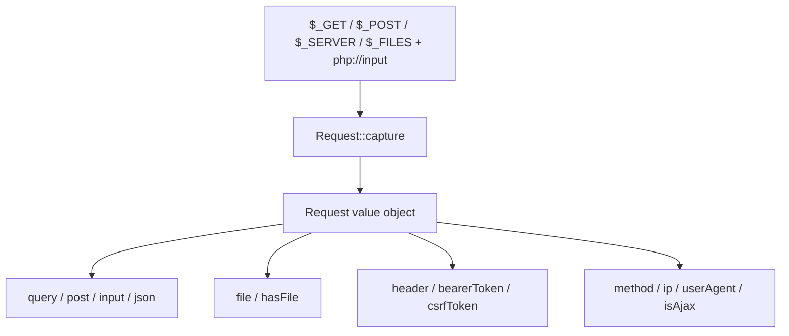
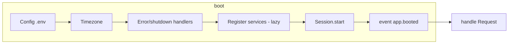
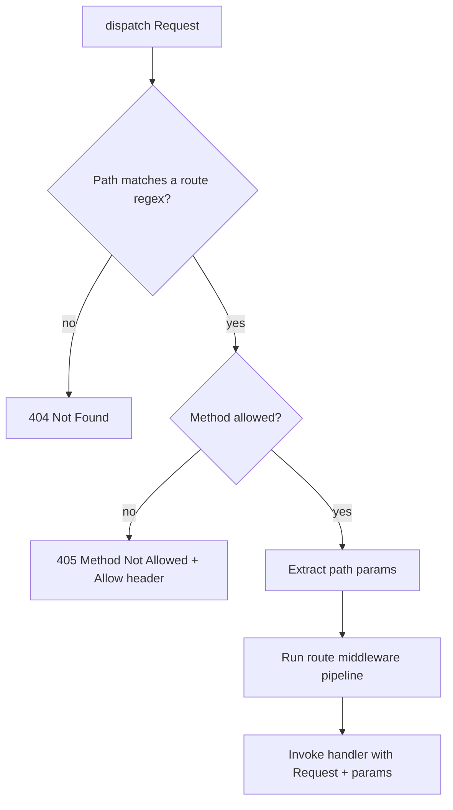
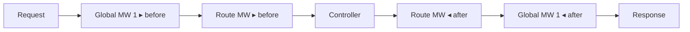
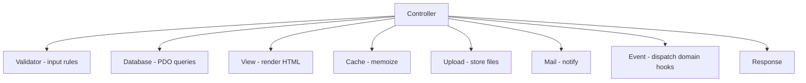
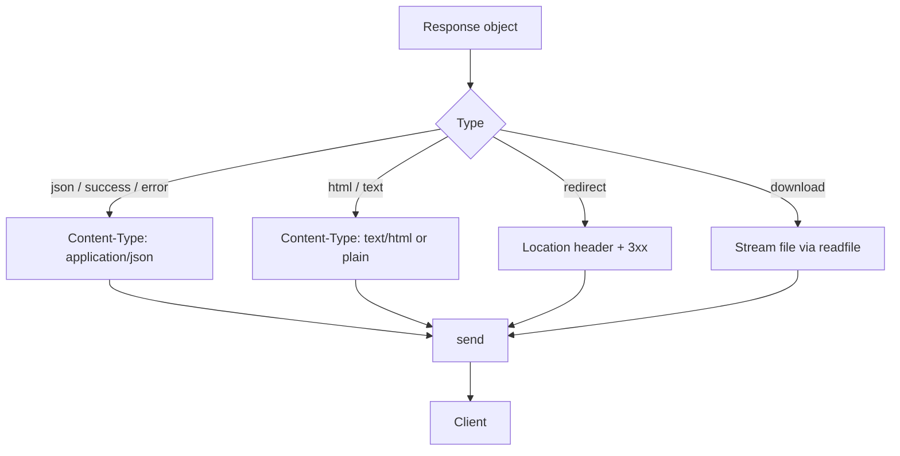
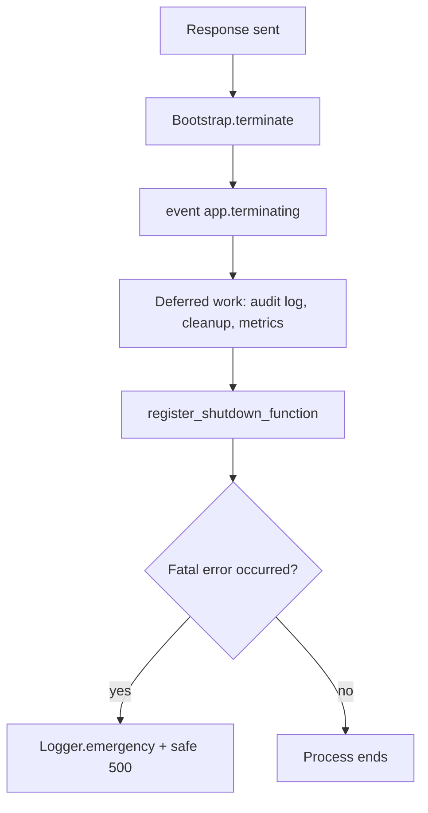
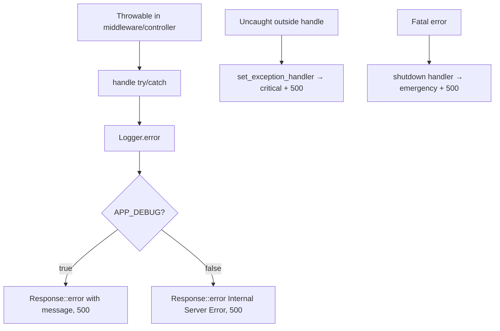
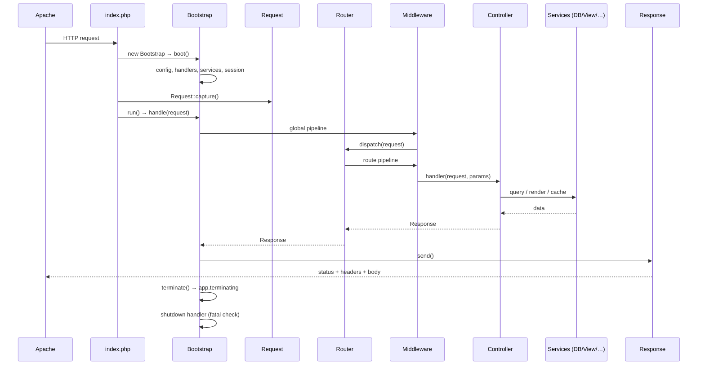

# Request Lifecycle

The complete journey of an HTTP request through a DMF application built on the
Core Framework — from the web server to shutdown.

> **Applies to template version:** `1.1.0` · **Namespace:** `DMF\Core`
> **Requires:** PHP 8.2+ · **Last updated:** 2026-07-14

Stages: **Request → Bootstrap → Router → Middleware → Controller → Response →
Shutdown.**

---

## Table of Contents

1. [The Big Picture](#the-big-picture)
2. [1. Request](#1-request)
3. [2. Bootstrap](#2-bootstrap)
4. [3. Router](#3-router)
5. [4. Middleware Pipeline](#4-middleware-pipeline)
6. [5. Controller](#5-controller)
7. [6. Response](#6-response)
8. [7. Shutdown](#7-shutdown)
9. [Error Path](#error-path)
10. [Sequence Diagram](#sequence-diagram)
11. [Cross References](#cross-references)

---

## The Big Picture


Every stage is a plain, testable call — there is no hidden magic between the
web server and your controller.

---

## 1. Request

Apache routes the URL to the single front controller (`public_html/index.php`);
`config/` and `includes/` sit above the web root and are never served directly.

`Request::capture()` snapshots the HTTP request into an immutable value object
built from the superglobals + `php://input`:

```php
$request = DMF\Core\Request::capture();
$request->method();      // "POST"
$request->input('name'); // merged query ∪ body ∪ JSON
$request->json('title'); // decoded JSON body member
$request->ip();          // client IP (REMOTE_ADDR)
$request->isAjax();      // X-Requested-With
```



---

## 2. Bootstrap

The kernel prepares the application, then turns the request into a response.
Full detail in [BOOTSTRAP.md](./BOOTSTRAP.md).



`handle(Request)` dispatches `request.received`, then runs the request through
the global middleware pipeline into the router, wrapped in a `try/catch` that
converts any `Throwable` into a logged, safe `500`.

---

## 3. Router

`Router::dispatch(Request)` matches the request **path** and **method** against
the registered routes:



- `{param}` and `{param:regex}` placeholders become named captures.
- Handlers may be closures or `[Controller::class, 'method']`.
- A non-`Response` return is coerced: arrays → `Response::json`, strings →
  `Response::html`.
- Reverse routing: `Router::url('users.show', ['id' => 5])` → `/users/5`.

---

## 4. Middleware Pipeline

Middleware wrap the request/response cycle as an **onion** — outermost first on
the way in, reverse on the way out. Global middleware (from `Bootstrap`) wrap
route middleware (from the `Router`), both composed by the same pipeline logic
in `DMF\Core\Middleware`.



A middleware either calls `$next($request)` to continue, or short-circuits by
returning its own `Response`:

```php
final class RequireLogin extends DMF\Core\Middleware
{
    public function __construct(private DMF\Core\Session $session) {}

    public function handle(Request $request, callable $next): Response
    {
        if (!$this->session->has('user_id')) {
            return Response::redirect('/auth/login.php');
        }
        return $next($request);   // continue the chain
    }
}
```

Because `Middleware` implements `__invoke`, instances plug straight into the
router: `$router->get('/admin', $h)->middleware(new RequireLogin($session));`.

---

## 5. Controller

The innermost layer is your handler ("controller"). It receives the `Request`
and matched route params, does the work using the resolved services, and returns
a `Response`. This is the **only** layer that contains application/business
logic — the framework provides none.

```php
final class HealthController
{
    public function __construct(private DMF\Core\Database $db) {}

    public function show(Request $request, array $params): Response
    {
        $ok = $this->db->scalar('SELECT 1') !== null;
        return Response::success(['status' => $ok ? 'ok' : 'degraded']);
    }
}
```

Typical collaborators, all resolved from the container:



---

## 6. Response

The controller returns a `Response`; `Bootstrap` dispatches `response.prepared`,
then `Response::send()` emits the status line, headers, and body exactly once.



`success()`/`error()` emit the platform's documented JSON envelope
(`{ success, data | message, errors }` — see [API.md](./API.md)).

---

## 7. Shutdown

After the response is sent, `Bootstrap::terminate()` runs post-response work and
dispatches `app.terminating`, then PHP's registered shutdown function performs
the final safety check.



Use `app.terminating` for work that should not delay the user — audit logging,
cache warming, sending queued notifications, emitting metrics.

---

## Error Path

Failures are contained at every layer and always logged:



No error leaks internals to the client in production, and no single request can
crash the process silently.

---

## Sequence Diagram



---

## Cross References

- [BOOTSTRAP.md](./BOOTSTRAP.md) — the startup phase in depth
- [CLASS_DIAGRAM.md](./CLASS_DIAGRAM.md) — every class and relationship
- [ARCHITECTURE.md](./ARCHITECTURE.md#request-flow) — the include-chain view
- [API.md](./API.md) — response envelope & status codes
- [SECURITY.md](./SECURITY.md#security-flow) — controls along the path

---

<sub>DMF PHP Template · Request Lifecycle · v1.1.0 · © 2026 Digital Media Foundation</sub>
