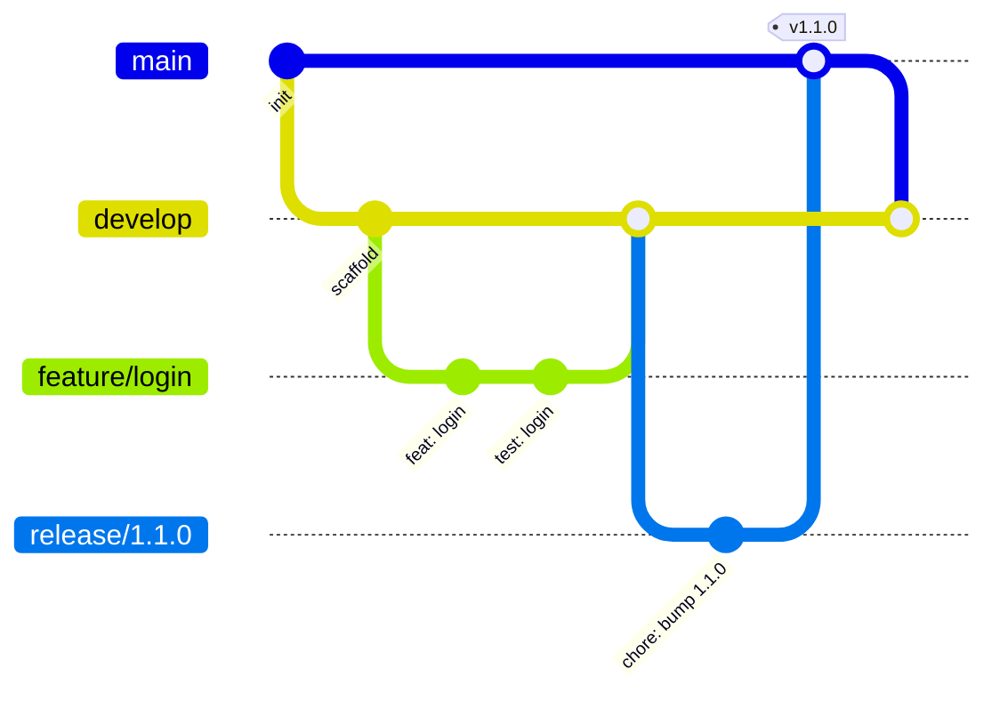

<div align="center">

# DMF PHP Template

**The official parent template for every PHP application in the DMF ecosystem.**

[](./LICENSE)
[](./VERSION)
[](https://www.php.net/)
[](https://www.php-fig.org/psr/psr-12/)
[](https://phpstan.org/)
[](https://github.com/)
[](#)

</div>

---

## Project Overview

**`dmf-template-php`** is the standardized foundation used to bootstrap all PHP
applications maintained by the **Digital Media Foundation (DMF)**. It provides a
clean, opinionated, production-ready project skeleton — directory layout, tooling
configuration, coding standards, and CI — so every DMF service starts from the
same enterprise-grade baseline.

This repository contains **no business logic**. It extracts the *reusable
architecture* of the platform's reference implementation (`projects.dmf.ac.th`)
— the same plain-procedural-PHP include chain (config → auth → permission →
routes → navbar), generalized and hardened — with every domain feature removed.
It is designed to be consumed as a **GitHub Template Repository**.

See [`docs/architecture.md`](./docs/architecture.md) for the full picture, and
[`docs/`](./docs) for database, coding-standard, git-workflow, and security
references.

### Applications built on this template

| Service | Domain |
| ------- | ------ |
| Projects | `projects.dmf.ac.th` |
| Timetable | `timetable.dmf.ac.th` |
| Grade | `grade.dmf.ac.th` |
| Library | `library.dmf.ac.th` |
| Inventory | `inventory.dmf.ac.th` |
| Health | `health.dmf.ac.th` |
| Plant | `plant.dmf.ac.th` |

---

## Features

- ✅ **Standardized directory structure** shared across all DMF PHP projects.
- ✅ **Environment-based configuration** via `.env` (12-factor friendly).
- ✅ **PSR-12 compatible** coding standard out of the box.
- ✅ **Static analysis** pre-configured with PHPStan.
- ✅ **Continuous Integration** with GitHub Actions (lint + static analysis matrix).
- ✅ **Cross-platform consistency** via `.editorconfig` and `.gitattributes`.
- ✅ **Secure defaults** — secrets, logs, caches, and uploads are git-ignored.
- ✅ **Issue & PR templates** for a consistent contribution workflow.
- ✅ **GitHub Template ready** — click *Use this template* to spin up a new service.

---

## Directory Structure

```text
dmf-template-php/
├── .github/                 # GitHub automation
│   ├── workflows/           # CI pipelines (lint, static analysis, tests)
│   └── ISSUE_TEMPLATE/      # Bug / feature issue templates
├── config/
│   └── config.php           # Constants + shared PDO $conn (reads .env)
├── database/
│   ├── migrations/          # Ordered .sql schema migrations (core only)
│   └── seeds/               # Seed data (initial admin user)
├── docs/                    # Architecture, database, standards, security
├── includes/                # Reusable architecture (above web root)
│   ├── env.php              #   dependency-free .env loader
│   ├── auth_check.php       #   session guard → $currentUser, $role, …
│   ├── permission.php       #   RBAC primitives + requirePermission()
│   ├── csrf.php             #   CSRF token helpers
│   ├── routes.php           #   ROUTES map + route()/redirect()
│   ├── mailer.php           #   dependency-free SMTP client
│   └── navbar.php           #   shared navigation component
├── public_html/             # The ONLY web server document root
│   ├── .htaccess            #   security headers + dotfile blocking
│   ├── index.php            #   entry redirect
│   ├── auth/                #   login.php, logout.php
│   ├── dashboard/           #   reference page (the include-chain pattern)
│   └── uploads/             #   web-served public assets (no PHP execution)
├── storage/                 # Runtime, git-ignored (cache, logs, uploads)
├── tests/                   # PHPUnit smoke tests
├── .editorconfig            # Editor formatting rules
├── .env.example             # Environment variable template
├── .gitattributes           # Line-ending normalization & archive rules
├── .gitignore               # Ignore rules
├── composer.json            # Dev tooling (PHPStan, PHPUnit, PHP-CS-Fixer)
├── LICENSE                  # MIT license
├── phpstan.neon.dist        # Static analysis configuration
├── phpunit.xml.dist         # Test-suite configuration
├── README.md                # This file
└── VERSION                  # Current semantic version
```

> **Note:** `public_html/` is the **only** directory that should be exposed as the
> web server's document root. Everything else lives above it and is inaccessible
> from the web.

---

## Requirements

| Requirement | Minimum Version |
| ----------- | --------------- |
| PHP | `8.1` |
| Composer | `2.x` |
| Web server | Apache 2.4+ / Nginx |
| Database | MySQL 8.0+ / MariaDB 10.5+ |

---

## Installation

Create a new project from this template using GitHub's **Use this template**
button, or clone it directly:

```bash
# 1. Create your project from the template
git clone https://github.com/dmf/dmf-template-php.git my-service
cd my-service

# 2. Configure the environment
cp .env.example .env
#    → edit .env and fill in your real values

# 3. Install dev tooling (PHPStan, PHPUnit, PHP-CS-Fixer)
composer install

# 4. Point your web server document root at:
#    /path/to/my-service/public_html

# 5. Run static analysis
vendor/bin/phpstan analyse
```

Ensure the `storage/` subdirectories are **writable** by the web server:

```bash
chmod -R 775 storage
```

---

## Git Workflow

This project follows a **GitHub Flow / Git Flow hybrid** suited to continuous
delivery. Feature work branches off `develop`, and releases are promoted to
`main`.



---

## Branch Strategy

| Branch | Purpose | Merges Into |
| ------ | ------- | ----------- |
| `main` | Production-ready, released code. Protected. | — |
| `develop` | Integration branch for the next release. | `main` (via release) |
| `feature/*` | New features and enhancements. | `develop` |
| `bugfix/*` | Non-urgent fixes. | `develop` |
| `release/*` | Release stabilization & version bump. | `main` + `develop` |
| `hotfix/*` | Urgent production fixes. | `main` + `develop` |

**Rules**
- `main` and `develop` are protected — no direct pushes; changes land via PR.
- Every PR must pass CI (lint + static analysis) and receive at least one review.
- Commit messages follow the **Conventional Commits** convention
  (`feat:`, `fix:`, `chore:`, `docs:`, `refactor:`, `test:`).

---

## Versioning

This project adheres to [**Semantic Versioning 2.0.0**](https://semver.org/).

```
MAJOR.MINOR.PATCH   →   e.g. 1.4.2
```

| Segment | Increment when… |
| ------- | --------------- |
| **MAJOR** | You make incompatible/breaking changes. |
| **MINOR** | You add functionality in a backward-compatible way. |
| **PATCH** | You make backward-compatible bug fixes. |

The single source of truth is the [`VERSION`](./VERSION) file. Bumping it is part
of every `release/*` branch and is tagged on `main` (e.g. `v1.1.0`).

---

## License

Distributed under the **MIT License**. See [`LICENSE`](./LICENSE) for full text.

© 2026 Digital Media Foundation (DMF).

---

## Contribution Guide

We welcome contributions from all DMF team members.

1. **Create a branch** from `develop` using the naming convention above
   (e.g. `feature/user-export`).
2. **Follow PSR-12.** Keep code clean and documented.
3. **Write/adjust tests** for your change where applicable.
4. **Run checks locally** before pushing:
   ```bash
   find . -name '*.php' -not -path './vendor/*' -print0 | xargs -0 -n1 php -l
   vendor/bin/phpstan analyse
   ```
5. **Open a Pull Request** into `develop` and fill in the PR template.
6. **Pass CI & review** — at least one approval is required to merge.

Report bugs and request features via the provided
[issue templates](./.github/ISSUE_TEMPLATE).

---

## Future Roadmap

| Phase | Scope |
| ----- | ----- |
| **Phase 1** ✅ | Project foundation — structure, tooling, standards, CI. |
| **Phase 2** ✅ | Configuration layer — `.env` loader, constants, shared PDO connection. |
| **Phase 3** ✅ | Core database schema (users, resets, audit) + seed + migration convention. |
| **Phase 4** ✅ | Authentication, idle-timeout sessions, RBAC primitives, CSRF. |
| **Phase 5** ✅ | Routing map + link helpers, shared navbar, reference page skeleton. |
| **Phase 6** | Observability — structured logging, error handling, health checks. |

---

<div align="center">
<sub>Built and maintained by the <strong>DMF Development Team</strong> · Powered by PHP</sub>
</div>
