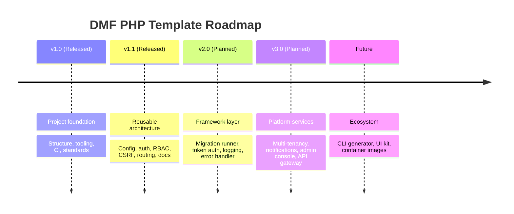
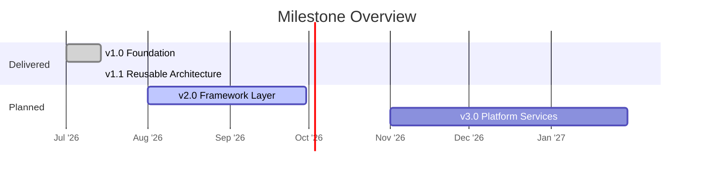
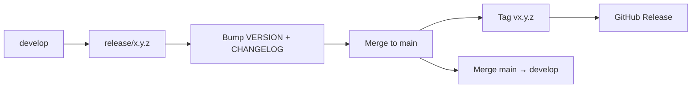

# Roadmap

The release history and forward plan for the **DMF PHP Template**. Versions
follow [Semantic Versioning 2.0.0](https://semver.org/); the current version is
tracked in [`VERSION`](./VERSION) and detailed in [`CHANGELOG.md`](./CHANGELOG.md).

> **Current version:** `1.1.0` · **Last updated:** 2026-07-14

---

## Table of Contents

1. [Release Timeline](#release-timeline)
2. [v1.0 — Foundation](#v10--foundation) ✅
3. [v1.1 — Reusable Architecture](#v11--reusable-architecture) ✅
4. [v2.0 — Framework Layer](#v20--framework-layer)
5. [v3.0 — Platform Services](#v30--platform-services)
6. [Future Features](#future-features)
7. [Release Process](#release-process)
8. [Cross References](#cross-references)

---

## Release Timeline

| Version | Status | Theme |
| ------- | ------ | ----- |
| v1.0 | ✅ Released | Project foundation |
| v1.1 | ✅ Released | Reusable architecture (current) |
| v2.0 | 🔜 Planned | Framework layer |
| v3.0 | 🗺 Planned | Platform services |
| Future | 💡 Exploratory | Ecosystem tooling |

---

## v1.0 — Foundation ✅

The standardized skeleton shared by every DMF PHP service.

- Standardized directory structure (`config`, `database`, `docs`, `includes`,
  `public_html`, `storage`, `tests`).
- Root tooling: `.editorconfig`, `.gitignore`, `.gitattributes`, `.env.example`,
  `phpstan.neon.dist`, `VERSION`, `LICENSE` (MIT).
- GitHub automation: CI workflow (lint + static analysis matrix), issue
  templates, PR template.
- Git standards: branch strategy, Conventional Commits, SemVer, `CHANGELOG.md`.

---

## v1.1 — Reusable Architecture ✅

The current release. Extracts the reusable architecture of
`projects.dmf.ac.th` with **all business logic removed**.

- **Configuration:** `config/config.php` + `includes/env.php` — constants and a
  single shared PDO `$conn`, secrets read from `.env`.
- **Authentication:** `auth_check.php` (session guard, idle timeout) plus
  `login.php` / `logout.php`.
- **Authorization:** `permission.php` — `hasRole()`, `requireRole()`,
  `requirePermission()`.
- **Request integrity:** `csrf.php` — token generation and verification.
- **Routing:** `routes.php` — central `ROUTES` map + link helpers.
- **Email:** `mailer.php` — dependency-free STARTTLS SMTP client.
- **UI:** `navbar.php` + reference `dashboard/` page demonstrating the include
  chain.
- **Security hardening:** `.htaccess` headers + dotfile blocking; uploads
  execution disabled.
- **Data:** core schema (`users`, `password_resets`, `login_attempts`,
  `audit_logs`) + seed + migration convention.
- **Tooling & docs:** `composer.json`, `phpunit.xml.dist`, smoke tests, and this
  enterprise documentation suite ([INSTALL](./INSTALL.md), [DATABASE](./DATABASE.md),
  [API](./API.md), [ARCHITECTURE](./ARCHITECTURE.md), [SECURITY](./SECURITY.md)).

---

## v2.0 — Framework Layer

Backward-compatible platform capabilities that stay true to the no-heavy-framework
philosophy. Some items may introduce breaking changes to bootstrap conventions,
hence the major bump.

| Area | Planned capability |
| ---- | ------------------ |
| Migrations | Lightweight migration runner + `schema_migrations` tracking table. |
| Auth | Optional stateless API tokens / API keys alongside sessions. |
| Rate limiting | Enforce `login_attempts` lockout out of the box. |
| Logging | Structured (JSON) logger writing to `storage/logs/`. |
| Errors | Central exception handler + friendly error pages. |
| Validation | Reusable input-validation helpers with the standard error envelope. |
| Pagination | Shared list/pagination helpers for the API `meta` block. |
| Health | `/health` endpoint (DB + mail reachability). |

---

## v3.0 — Platform Services

Larger, opt-in building blocks for cross-cutting DMF concerns.

| Area | Planned capability |
| ---- | ------------------ |
| Multi-tenancy | Generic `tenant_id` scoping pattern + tenant switcher (generalized from the reference's multi-school model). |
| Notifications | Pluggable channels (email, LINE, webhooks). |
| Admin console | Reusable users / roles / audit-log management UI. |
| RBAC | Optional fine-grained permissions (`role_permissions`) beyond flat roles. |
| API gateway | Shared SSO / gateway integration for the DMF ecosystem. |
| Observability | Metrics + request tracing hooks. |

---

## Future Features

Exploratory, not yet scheduled:

- **CLI generator** — scaffold a new module (page + route + migration + test).
- **Shared UI kit** — extractable CSS tokens and components as an optional
  package.
- **Container images** — official Docker/Podman image + Compose for local dev.
- **Automated dependency & security scanning** in CI (Dependabot, SAST).
- **i18n layer** — translation helper for multi-language UIs.
- **Read-replica support** — optional split of read/write PDO connections.

---

## Release Process

Releases follow the branch strategy and SemVer rules in
[docs/git-workflow.md](./docs/git-workflow.md):

Every release: green CI (lint + static analysis + tests), an updated
`CHANGELOG.md`, a bumped `VERSION`, and a signed tag `vX.Y.Z`.

---

## Cross References

- [CHANGELOG.md](./CHANGELOG.md) — detailed change history
- [ARCHITECTURE.md](./ARCHITECTURE.md) — what each release builds on
- [SECURITY.md](./SECURITY.md) — security items on the roadmap
- [docs/git-workflow.md](./docs/git-workflow.md) — versioning & release mechanics
- [README.md](./README.md) — project overview

---

DMF PHP Template · Roadmap · v1.1.0 · © 2026 Digital Media Foundation
