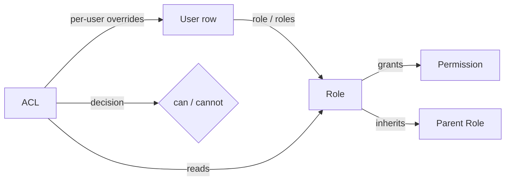
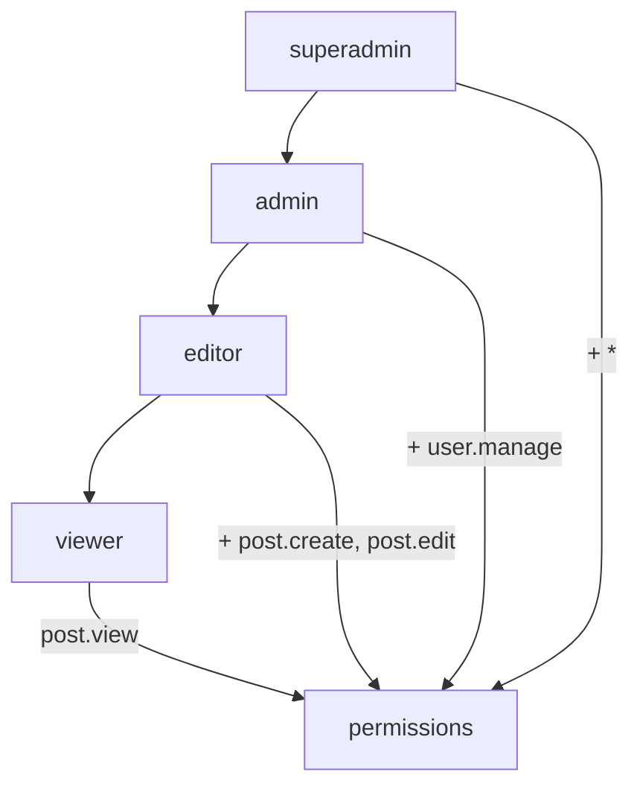
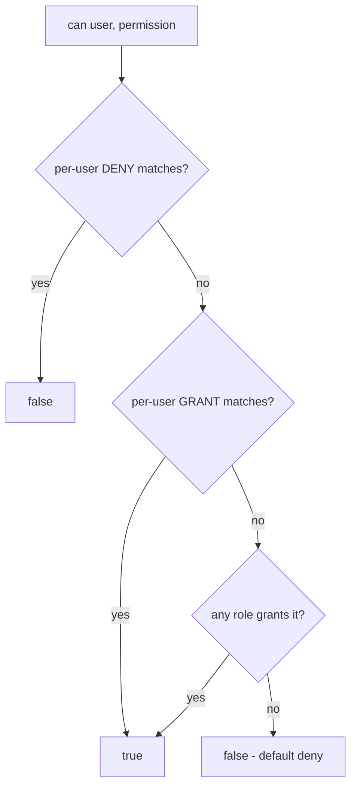

# Role Model

How roles and permissions are defined and combined in the `DMF\Auth` package —
the vocabulary the [ACL](./ACL.md) evaluates.

> **Applies to template version:** `1.1.0` · **Namespace:** `DMF\Auth`
> **Requires:** PHP 8.2+ · **Last updated:** 2026-07-14

The package ships the **mechanism** only. It defines **no** application roles or
permissions — each service registers its own.

---

## Table of Contents

1. [Concepts](#concepts)
2. [Permissions](#permissions)
3. [Roles](#roles)
4. [Role Hierarchy](#role-hierarchy)
5. [Wildcards](#wildcards)
6. [How a User Carries Roles](#how-a-user-carries-roles)
7. [Registering Your Model](#registering-your-model)
8. [Evaluation Order](#evaluation-order)
9. [Cross References](#cross-references)

---

## Concepts



| Term | Meaning |
| ---- | ------- |
| **Permission** | A fine-grained capability string, e.g. `post.create`. |
| **Role** | A named bundle of permissions, e.g. `editor`. |
| **Hierarchy** | A role may inherit permissions from parent roles. |
| **Wildcard** | `*` (all) or `post.*` (a family) matches many permissions. |
| **ACL** | The engine that decides `can(user, permission)`. |

Roles and permissions are held in static registries (`Role`, `Permission`), so
the model is declared once at bootstrap and available everywhere.

---

## Permissions

```php
use DMF\Auth\Permission;

Permission::define('post.create', 'Create posts');
Permission::define('post.delete', 'Delete posts');
Permission::define('user.manage', 'Manage user accounts');

Permission::exists('post.create'); // true
Permission::names();               // ['post.create', 'post.delete', 'user.manage']
```

The registry is optional documentation/validation — the ACL works with any
permission string — but declaring them makes the capability surface discoverable
and typo-checkable.

---

## Roles

```php
use DMF\Auth\Role;

Role::define('viewer', ['post.view']);
Role::define('editor', ['post.view', 'post.create', 'post.edit']);
Role::define('admin',  ['*']);   // everything

Role::get('editor')->hasPermission('post.create'); // true
Role::get('viewer')->hasPermission('post.create'); // false
```

---

## Role Hierarchy

A role inherits every permission of its declared parents (transitively).



```php
Role::define('viewer', ['post.view']);
Role::define('editor', ['post.create', 'post.edit'], ['viewer']);        // inherits viewer
Role::define('admin',  ['user.manage'],               ['editor']);        // inherits editor→viewer
Role::define('superadmin', ['*'],                      ['admin']);

Role::get('admin')->hasPermission('post.view');   // true (inherited from viewer)
Role::get('editor')->permissions();               // create, edit, view
```

> Hierarchies must be acyclic. `permissions()` merges and de-duplicates the
> inherited set.

---

## Wildcards

`Role::matches($granted, $permission)` powers both roles and ACL overrides:

| Granted | Matches | Notes |
| ------- | ------- | ----- |
| `*` | everything | super-admin grant |
| `post.*` | `post.create`, `post.edit`, … | a permission family |
| `post.create` | `post.create` only | exact |

```php
Role::define('moderator', ['post.*', 'comment.*']);
Role::get('moderator')->hasPermission('post.delete');    // true
Role::get('moderator')->hasPermission('user.manage');    // false
```

---

## How a User Carries Roles

The ACL reads a user's roles from a plain array (typically a `users` row):

```php
// Single role (matches the core schema's users.role column):
$user = ['id' => 5, 'role' => 'editor'];

// Or multiple roles:
$user = ['id' => 5, 'roles' => ['editor', 'moderator']];
```

Both forms are supported; `roles` (array) takes precedence when present.

---

## Registering Your Model

Declare the model once during bootstrap (e.g. an `app.booted` listener):

```php
use DMF\Auth\{Permission, Role};

// Permissions
foreach (['post.view', 'post.create', 'post.edit', 'post.delete', 'user.manage'] as $p) {
    Permission::define($p);
}

// Roles (low → high)
Role::define('viewer', ['post.view']);
Role::define('editor', ['post.create', 'post.edit'], ['viewer']);
Role::define('admin',  ['post.delete', 'user.manage'], ['editor']);
Role::define('super_admin', ['*']);
```

This model is **template-generic** — replace the names with your application's
own. Nothing here assumes a particular domain.

---

## Evaluation Order

When the ACL answers `can($user, $permission)`:



Full detail in [ACL.md](./ACL.md).

---

## Cross References

- [ACL.md](./ACL.md) — the decision engine and per-user overrides
- [AUTHENTICATION.md](./AUTHENTICATION.md) — where roles gate requests (middleware)
- [SESSION_FLOW.md](./SESSION_FLOW.md) — how the user is loaded per request
- [SECURITY.md](./SECURITY.md#owasp-top-10-coverage) — access-control controls

---

<sub>DMF PHP Template · Role Model · v1.1.0 · © 2026 Digital Media Foundation</sub>
