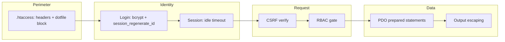
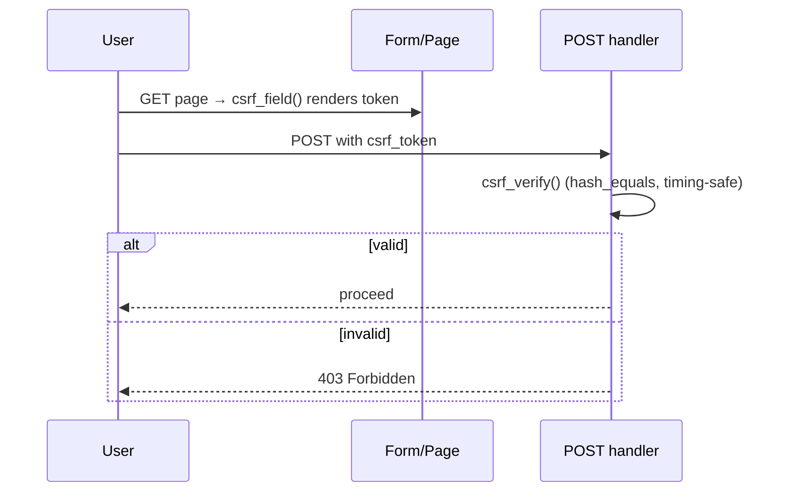
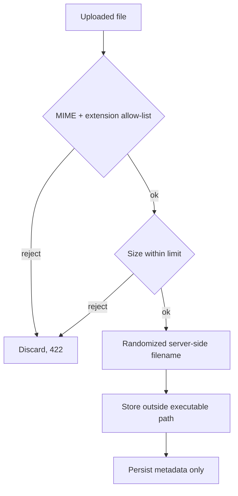
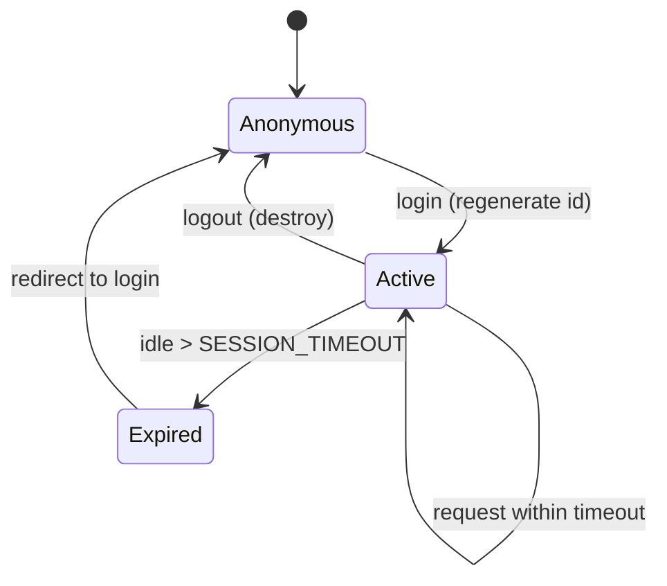
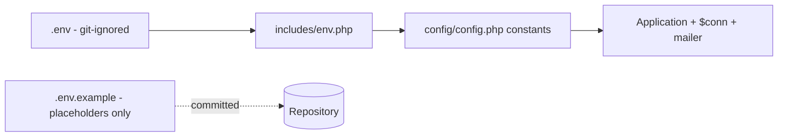

# Security Guide

The security baseline every application inherits from the **DMF PHP Template**,
mapped to the OWASP Top 10 and the platform's concrete controls.

> **Applies to template version:** `1.1.0` · **Last updated:** 2026-07-14

The template ships the secure defaults the reference implementation
(`projects.dmf.ac.th`) had listed as "areas for improvement." Treat this as the
minimum bar — do not regress below it.

---

## Table of Contents

1. [Security Model](#security-model)
2. [OWASP Top 10 Coverage](#owasp-top-10-coverage)
3. [CSRF](#csrf)
4. [XSS](#xss)
5. [SQL Injection](#sql-injection)
6. [Upload Validation](#upload-validation)
7. [Security Headers](#security-headers)
8. [Session Management](#session-management)
9. [Password Handling](#password-handling)
10. [Secrets Management](#secrets-management)
11. [Reporting Vulnerabilities](#reporting-vulnerabilities)
12. [Cross References](#cross-references)

---

## Security Model



Defense in depth: no single control is trusted alone. Every layer above is
independently enforced.

---

## OWASP Top 10 Coverage

| OWASP (2021) | Template control |
| ------------ | ---------------- |
| A01 Broken Access Control | `requirePermission()` / `requireRole()` gate; only `public_html/` served. |
| A02 Cryptographic Failures | bcrypt password hashing; secrets in `.env`; TLS/HSTS guidance. |
| A03 Injection | PDO prepared statements only; `htmlspecialchars()` output escaping. |
| A04 Insecure Design | Fixed include chain, secure defaults, least-privilege DB user. |
| A05 Security Misconfiguration | `APP_DEBUG=false` in prod; `.htaccess` headers; config above web root. |
| A06 Vulnerable Components | No runtime dependencies; dev tooling pinned in `composer.json`. |
| A07 Auth Failures | Session regeneration, idle timeout, uniform login errors, `login_attempts` scaffold. |
| A08 Integrity Failures | CSRF tokens; no code execution in uploads. |
| A09 Logging Failures | `audit_logs` table; server-side error logging. |
| A10 SSRF | No outbound user-controlled requests in the base template. |

---

## CSRF

Every state-changing request must carry a valid token — implemented in
[`includes/csrf.php`](./includes/csrf.php).



**Forms:**

```php
<form method="POST" action="/api/create_document.php">
    <?= csrf_field() ?>
    <!-- fields -->
</form>
```

**Handler:**

```php
require_once __DIR__ . '/../../includes/csrf.php';
csrf_require();   // 403 (JSON for XHR) if the token is missing/invalid
```

**AJAX:** send the token from `csrf_token()` in the `X-CSRF-Token` header — see
[API.md](./API.md#csrf-protection). Tokens are 256-bit, per-session, compared
with `hash_equals()`.

---

## XSS

- **Escape on output**, always, with `htmlspecialchars()`:

```php
echo htmlspecialchars($user['name'], ENT_QUOTES, 'UTF-8');
```

- Never build HTML from raw request data. Treat all DB values as untrusted on
  render, not just on input.
- For attributes and URLs, escape context-appropriately; validate URLs with
  `filter_var($url, FILTER_VALIDATE_URL)`.
- The login redirect only accepts local paths (`/...`, rejecting `//host`) to
  prevent open-redirect / reflected injection.
- A Content-Security-Policy is recommended for stricter deployments (see
  [Security Headers](#security-headers)).

---

## SQL Injection

**The only permitted database access pattern is a PDO prepared statement with
positional parameters.** No exceptions.

```php
// ✅ correct
$stmt = $conn->prepare('SELECT id, name FROM users WHERE role = ? AND is_active = 1');
$stmt->execute([$role]);

// ❌ forbidden — never interpolate input into SQL
// $conn->query("SELECT * FROM users WHERE role = '$role'");
```

- `PDO::ATTR_EMULATE_PREPARES => false` ensures real server-side prepares.
- For dynamic `IN (...)` lists, build placeholders, never values:

```php
$in = implode(',', array_fill(0, count($ids), '?'));
$stmt = $conn->prepare("SELECT id FROM users WHERE id IN ($in)");
$stmt->execute($ids);
```

- Column/table names cannot be parameterized — whitelist them against a fixed
  allow-list before interpolation.

See [DATABASE.md](./DATABASE.md#database-conventions).

---

## Upload Validation

User uploads are the classic remote-code-execution vector. The template blocks
execution at the web-server layer via
[`public_html/uploads/.htaccess`](./public_html/uploads/.htaccess) and requires
application-side validation on top.



Application checklist:

- Validate against an **allow-list** of extensions and MIME types — never a
  block-list.
- Verify real content type with `finfo` (`FILEINFO_MIME_TYPE`), not the
  client-supplied header.
- Enforce a maximum size (`upload_max_filesize` / `post_max_size` + app check).
- **Rename** on storage (e.g. `bin2hex(random_bytes(8))`); never trust the
  client filename.
- Store private files under `storage/uploads/` (not web-served). Only truly
  public assets go under `public_html/uploads/`, where `.htaccess` disables PHP
  handlers.

```php
$allowed = ['image/jpeg' => 'jpg', 'image/png' => 'png', 'application/pdf' => 'pdf'];
$mime = (new finfo(FILEINFO_MIME_TYPE))->file($_FILES['doc']['tmp_name']);
if (!isset($allowed[$mime]) || $_FILES['doc']['size'] > 8 * 1024 * 1024) {
    http_response_code(422);
    exit(json_encode(['success' => false, 'message' => 'Invalid file.']));
}
$name = bin2hex(random_bytes(8)) . '.' . $allowed[$mime];
move_uploaded_file($_FILES['doc']['tmp_name'], STORAGE_PATH . '/uploads/' . $name);
```

---

## Security Headers

Set in [`public_html/.htaccess`](./public_html/.htaccess):

| Header | Value | Purpose |
| ------ | ----- | ------- |
| `X-Content-Type-Options` | `nosniff` | Stop MIME sniffing. |
| `X-Frame-Options` | `SAMEORIGIN` | Clickjacking defense. |
| `Referrer-Policy` | `strict-origin-when-cross-origin` | Limit referrer leakage. |
| `X-XSS-Protection` | `1; mode=block` | Legacy browser XSS filter. |
| `Strict-Transport-Security` | `max-age=31536000; includeSubDomains` | Force HTTPS (enable after TLS). |

Also enforced: `Options -Indexes` (no directory listing), dotfile and
sensitive-extension blocking (`.env`, `.git`, `.sql`, `.log`, …), and
`expose_php off`.

Recommended additional header for hardened deployments:

```apache
Header always set Content-Security-Policy "default-src 'self'; img-src 'self' https: data:; style-src 'self' 'unsafe-inline' https:; script-src 'self' https:; font-src 'self' https:"
```

---

## Session Management

Implemented across `auth_check.php` and `auth/login.php`:

- `session_regenerate_id(true)` on successful login — prevents session fixation.
- **Idle timeout** of `SESSION_TIMEOUT` seconds enforced on every request; the
  session is destroyed and the user redirected on expiry.
- Full teardown on logout: `$_SESSION = []`, cookie cleared, `session_destroy()`.
- Recommended `php.ini` / cookie flags: `HttpOnly`, `Secure` (HTTPS),
  `SameSite=Lax`, `session.use_strict_mode = 1`.



---

## Password Handling

- Hash with `password_hash($pw, PASSWORD_BCRYPT)`; verify with
  `password_verify()`. Never store or log plaintext.
- Uniform authentication errors — the login never reveals whether a username
  exists (mitigates enumeration).
- Password resets store only the **sha256 hash** of a single-use token with an
  expiry (`password_resets` table); the raw token is emailed, never persisted.
- `login_attempts` ships ready to enforce lockout / rate limiting after N
  failures per username/IP.
- Recommended policy: minimum length ≥ 10, block known-breached passwords, and
  rehash on login when `password_needs_rehash()` returns true.

---

## Secrets Management



- Real secrets live in `.env` at the project root — **git-ignored**, outside
  `public_html/`. Only `.env.example` (placeholders) is committed.
- `.htaccess` denies HTTP access to `.env` as a second line of defense.
- Set `APP_ENV=production` and `APP_DEBUG=false` in production so nothing
  sensitive is ever rendered to a client.
- Rotate any credential that has ever appeared in git history.
- Restrict the database user to least privilege (see [INSTALL.md](./INSTALL.md#mysql--mariadb)).

---

## Reporting Vulnerabilities

Report security issues **privately** to the DMF development team — do not open a
public issue or PR that discloses the flaw. Never include live secrets or
credentials in a report. Coordinated disclosure is expected before any public
write-up.

---

## Cross References

- [ARCHITECTURE.md](./ARCHITECTURE.md#security-flow) — where each control sits
- [API.md](./API.md#error-handling) — safe error responses
- [DATABASE.md](./DATABASE.md#database-conventions) — prepared-statement policy
- [INSTALL.md](./INSTALL.md#post-installation-checklist) — deployment hardening
- [ROADMAP.md](./ROADMAP.md) — planned security enhancements

---

<sub>DMF PHP Template · Security Guide · v1.1.0 · © 2026 Digital Media Foundation</sub>
