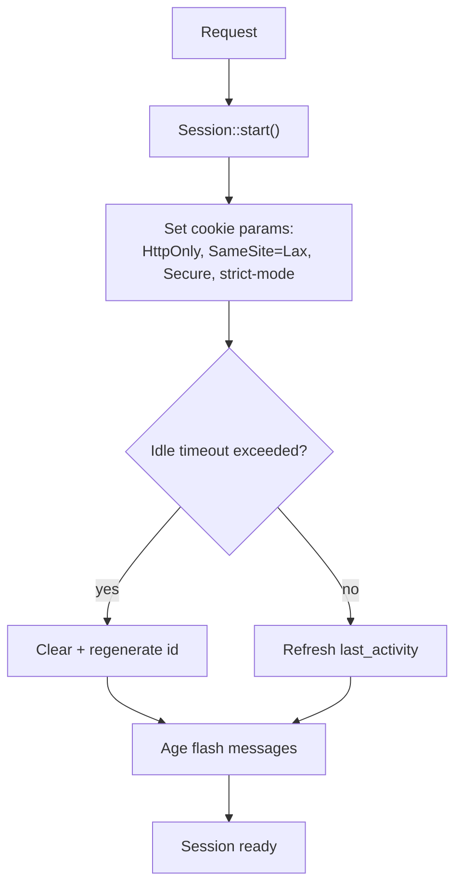
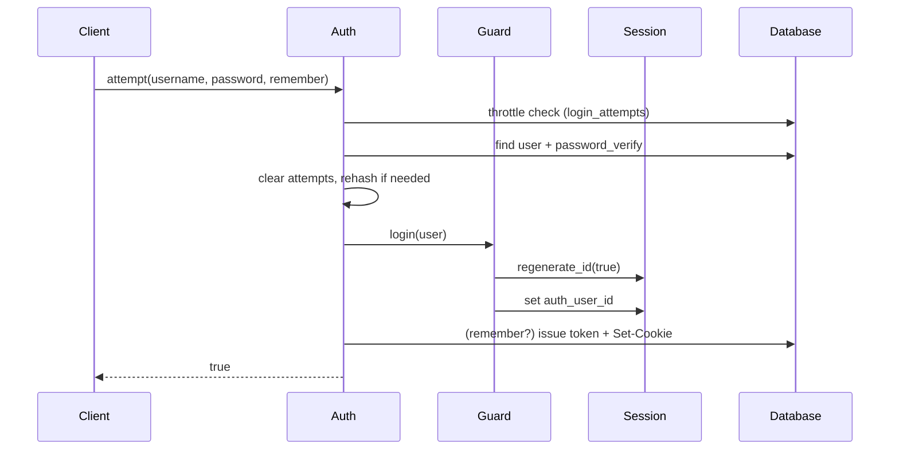
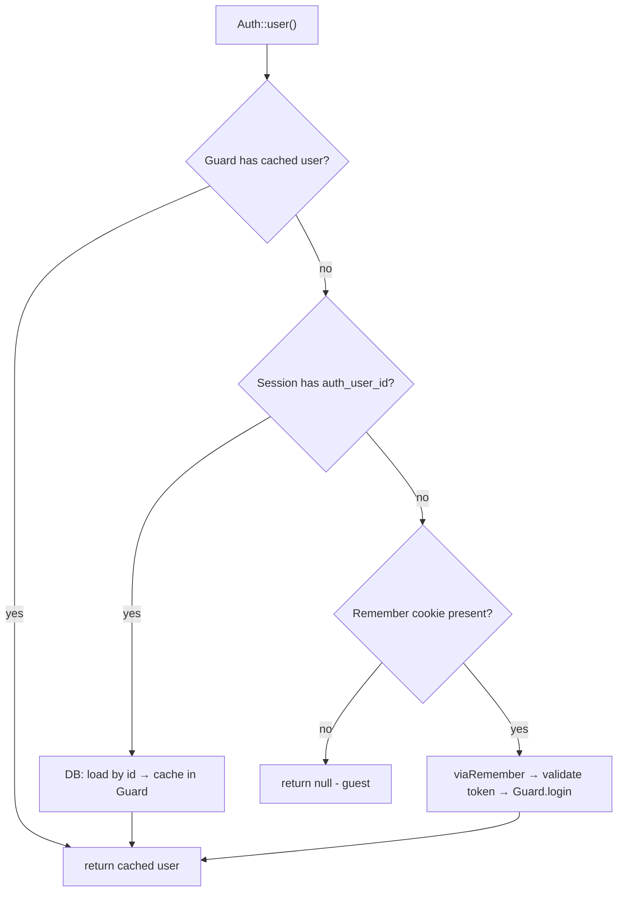
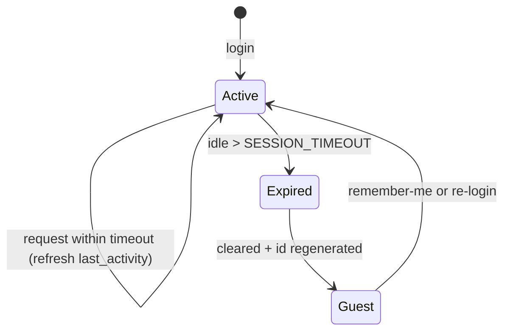
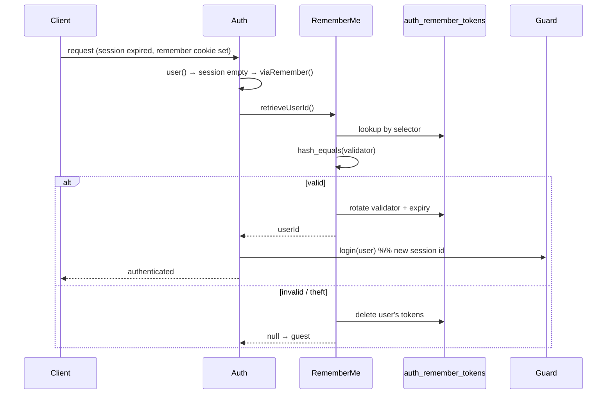
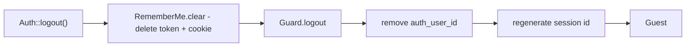

# Session Flow

The full lifecycle of an authenticated session in the `DMF\Auth` package —
start, login, per-request resolution, timeout, remember-me, and logout — built
on the frozen Core `Session`.

> **Applies to template version:** `1.1.0` · **Namespace:** `DMF\Auth`
> **Requires:** PHP 8.2+ · **Last updated:** 2026-07-14

---

## Table of Contents

1. [Actors](#actors)
2. [Session Start](#session-start)
3. [Login](#login)
4. [Per-Request Identity Resolution](#per-request-identity-resolution)
5. [Idle Timeout](#idle-timeout)
6. [Remember-Me Re-Authentication](#remember-me-re-authentication)
7. [Logout](#logout)
8. [Session Security Summary](#session-security-summary)
9. [Cross References](#cross-references)

---

## Actors

| Actor | Role in the flow |
| ----- | ---------------- |
| Core `Session` | Cookie params, id regeneration, idle timeout, storage. |
| `Guard` | Holds the authenticated user id in the session + request cache. |
| `Auth` | Login flow, throttle, resolves the user, coordinates RememberMe. |
| `RememberMe` | Persistent-login cookie + token store. |

---

## Session Start

Every request begins by starting the session (typically in `Bootstrap::boot()`):



The cookie is HttpOnly + SameSite=Lax, Secure on HTTPS, with
`session.use_strict_mode` on — the hardened defaults from Core.

---

## Login



The session id is **regenerated on login** (fixation defense), and the user id is
the only identity stored server-side.

---

## Per-Request Identity Resolution

On each request, `Auth::user()` resolves the current user in cost order — cache
first, database only when needed, remember-cookie as a last resort:



`check()` is simply `user() !== null`; `id()` reads the session id (or the loaded
user). Middleware call these to gate requests.

---

## Idle Timeout

The Core `Session` enforces an idle timeout (`SESSION_TIMEOUT`, default 1800s).
If the gap since `last_activity` exceeds it, the session is cleared and its id
regenerated on the next `start()` — the user becomes a guest.



A remembered user whose session expired is transparently re-authenticated from
the remember cookie on the next request (below).

---

## Remember-Me Re-Authentication



Best practice built in: the validator is **rotated on every use**, and a
selector-match with a validator-mismatch purges the user's tokens (treated as
theft).

---

## Logout



```php
$auth->logout();
header('Location: /auth/login.php');
exit;
```

---

## Session Security Summary

| Control | Where |
| ------- | ----- |
| Secure cookie flags | Core `Session::start()` + `RememberMe` |
| Fixation defense | `regenerate_id(true)` on login/logout/remember |
| Idle timeout | Core `Session` (`SESSION_TIMEOUT`) |
| Minimal server state | only `auth_user_id` in session |
| Remember token safety | hashed validator, rotation, theft purge |
| CSRF | `CSRF` token per session (see [AUTHENTICATION.md](./AUTHENTICATION.md#csrf)) |

---

## Cross References

- [AUTHENTICATION.md](./AUTHENTICATION.md) — the full login/reset/CSRF surface
- [ROLE_MODEL.md](./ROLE_MODEL.md) & [ACL.md](./ACL.md) — authorization
- [LIFECYCLE.md](./LIFECYCLE.md) — the request lifecycle Auth plugs into
- [SECURITY.md](./SECURITY.md#session-management) — session hardening baseline

---

<sub>DMF PHP Template · Session Flow · v1.1.0 · © 2026 Digital Media Foundation</sub>
