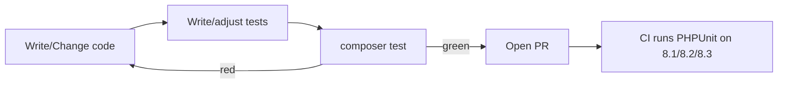
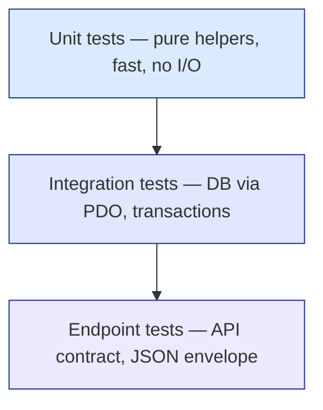
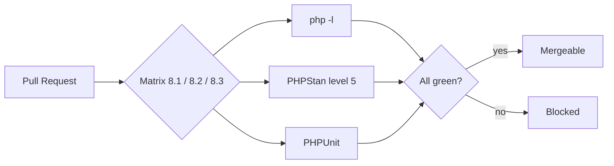

# Testing Guide

The testing convention, structure, and tooling for the **DMF PHP Template** —
PHPUnit, the test pyramid, fixtures, and CI integration.

> **Applies to template version:** `1.1.0` · **Last updated:** 2026-07-14

---

## Table of Contents

1. [Philosophy](#philosophy)
2. [Toolchain](#toolchain)
3. [Test Structure](#test-structure)
4. [The Test Pyramid](#the-test-pyramid)
5. [Naming Convention](#naming-convention)
6. [Writing Tests](#writing-tests)
7. [Database Tests](#database-tests)
8. [Running Tests](#running-tests)
9. [Coverage](#coverage)
10. [CI Integration](#ci-integration)
11. [Cross References](#cross-references)

---

## Philosophy

- Tests are a **merge gate**, not an afterthought — see [DEVOPS.md](./DEVOPS.md#quality-gates).
- Favor many fast, dependency-free unit tests over few slow ones.
- Keep the reusable architecture (`includes/`, `config/`) covered; application
  code adds its own tests on top.
- A test must fail for exactly one reason and be deterministic (no clocks,
  randomness, or network unless controlled).



---

## Toolchain

| Concern | Tool | Config |
| ------- | ---- | ------ |
| Test runner | PHPUnit 10 | `phpunit.xml.dist` |
| Bootstrap | Shared autoload of dependency-free includes | `tests/bootstrap.php` |
| Command | `composer test` → `phpunit` | `composer.json` |
| Coverage (optional) | Xdebug / PCOV | `--coverage-*` flags |

`phpunit.xml.dist` sets `bootstrap="tests/bootstrap.php"`, discovers the
`tests/` directory, enables `failOnWarning` and `failOnRisky`, and marks
`includes/` + `config/` as the covered source.

---

## Test Structure

```text
tests/
├── bootstrap.php        # loads dependency-free includes (env, routes, permission)
└── CoreTest.php         # smoke tests for the reusable helpers
```

`tests/bootstrap.php` loads only files that are safe to exercise without a DB or
an active web request:

```php
<?php
declare(strict_types=1);

require_once __DIR__ . '/../includes/env.php';
require_once __DIR__ . '/../includes/routes.php';
require_once __DIR__ . '/../includes/permission.php';
```

Add application tests alongside `CoreTest.php` (e.g. `tests/DocumentTest.php`),
grouping by the unit under test.

---

## The Test Pyramid



| Level | Scope | Speed | Example |
| ----- | ----- | ----- | ------- |
| Unit | One function, no I/O | ⚡ fast | `route()`, `hasRole()`, `env()` |
| Integration | DB via `$conn`, transactions | medium | insert + `audit_logs` write |
| Endpoint | HTTP contract / JSON envelope | slower | `POST /api/*` returns the standard shape |

Keep most tests at the unit level; reserve integration/endpoint tests for
behavior that only emerges across boundaries.

---

## Naming Convention

- File: `<Subject>Test.php` (PascalCase), one class `final class <Subject>Test`.
- Class extends `PHPUnit\Framework\TestCase`.
- Methods: `test<Behavior>()`, descriptive and specific.
- One logical assertion target per test; use data providers for variants.

```php
public function testRouteAppendsQueryString(): void
public function testHasRoleIsCaseInsensitive(): void
```

---

## Writing Tests

The shipped `tests/CoreTest.php` demonstrates the style — exercising the
reusable helpers with no database or network:

```php
<?php

declare(strict_types=1);

use PHPUnit\Framework\TestCase;

final class CoreTest extends TestCase
{
    public function testRouteBuildsPathWithoutParams(): void
    {
        self::assertSame('/dashboard/', route('dashboard'));
    }

    public function testRouteAppendsQueryString(): void
    {
        self::assertSame('/admin/users.php?id=5', route('admin.users', ['id' => 5]));
    }

    public function testHasRoleIsCaseInsensitive(): void
    {
        self::assertTrue(hasRole('Admin', 'admin', 'super_admin'));
        self::assertFalse(hasRole('user', 'admin'));
    }
}
```

Guidelines:

- Arrange → Act → Assert; keep each phase visible.
- Prefer `assertSame` (strict) over `assertEquals` for scalars.
- Use data providers for tabular cases:

```php
/**
 * @dataProvider roleCases
 */
public function testIsAdminRole(string $role, bool $expected): void
{
    self::assertSame($expected, isAdminRole($role));
}

/** @return array<string, array{0:string,1:bool}> */
public static function roleCases(): array
{
    return [
        'super_admin' => ['super_admin', true],
        'admin'       => ['admin', true],
        'user'        => ['user', false],
    ];
}
```

---

## Database Tests

The base template's tests are deliberately DB-free (fast, no fixtures). When an
application needs integration tests:

- Use a dedicated **test database**, never production; configure it via a
  `.env.testing` and a test bootstrap.
- Wrap each test in a transaction and roll back in `tearDown()` so tests stay
  isolated and repeatable.

```php
protected function setUp(): void
{
    $this->conn = testConnection();   // app-provided PDO to the test DB
    $this->conn->beginTransaction();
}

protected function tearDown(): void
{
    $this->conn->rollBack();          // discard all writes
}
```

Keep DB tests out of the default fast suite (a separate PHPUnit `<testsuite>` or
`@group integration`) so the unit suite stays quick.

---

## Running Tests

```bash
composer test                       # full suite (phpunit)
vendor/bin/phpunit                  # same, directly
vendor/bin/phpunit --filter testRouteAppendsQueryString
vendor/bin/phpunit tests/CoreTest.php
vendor/bin/phpunit --testdox        # human-readable output

# everything the gate checks
composer check                      # lint + analyse + test
```

---

## Coverage

Coverage requires a driver (Xdebug or PCOV). The template's source scope is
`includes/` + `config/` (declared in `phpunit.xml.dist`).

```bash
XDEBUG_MODE=coverage vendor/bin/phpunit --coverage-text
XDEBUG_MODE=coverage vendor/bin/phpunit --coverage-html build/coverage
```

Guidance: treat coverage as a signal, not a target. Prioritize covering the
reusable helpers and any branching logic; don't chase 100% on trivial glue.

---

## CI Integration

Tests run in the GitHub Actions pipeline across the PHP matrix (see
[DEVOPS.md](./DEVOPS.md#cicd-pipeline)).



The current CI job runs lint + static analysis and is structured to run the
PHPUnit suite as the test gate; extend `.github/workflows/ci.yml` with an
explicit `composer test` step as your suite grows.

---

## Cross References

- [DEVOPS.md](./DEVOPS.md) — CI/CD & quality gates
- [CODING_STANDARD.md](./CODING_STANDARD.md) — code the tests protect
- [DATABASE.md](./DATABASE.md#database-conventions) — transactions used in DB tests
- [API.md](./API.md) — the JSON contract endpoint tests assert
- [ROADMAP.md](./ROADMAP.md) — planned test tooling

---

<sub>DMF PHP Template · Testing Guide · v1.1.0 · © 2026 Digital Media Foundation</sub>
