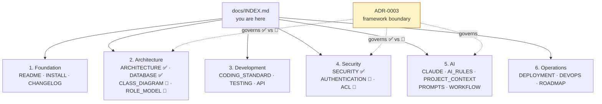

# Documentation Index

> The map of all documentation for the **DMF PHP Framework** (`dmf-template-php`).
> Start here. This index only points to documents — it never restates them.
>
> **Verified:** 2026-07-20 · The live repository is always the source of truth.

---

## Runtime legend (read before the tables)

Per [`docs/ai/DECISIONS.md` ADR-0003](./ai/DECISIONS.md#adr-0003-framework-boundary--procedural-is-the-runtime-dmfcoredmfauth-activate-only-on-explicit-v2x-migration),
the framework ships **two architectures**, and each document describes one of them:

- ✅ **Current (procedural v1.x)** — the **wired, production runtime**: procedural
  PHP + include-chain + PDO. This is what every generated application runs today.
- 🔮 **v2.x target (dormant)** — the OOP `DMF\Core` / `DMF\Auth` framework. The code
  exists in `includes/Core/` and `includes/Auth/` but is **not wired**; it activates
  only on explicit v2.x migration. **Do not treat 🔮 docs as the current runtime.**

---

## Primary navigation

### 1. Foundation
*What the project is and how to stand it up.*

| Doc | Runtime | Purpose |
| --- | ------- | ------- |
| [README](../README.md) | ✅ | Project overview, features, directory layout, quick start. |
| [QUICK_START](./QUICK_START.md) | ✅ | Six-step fast path from clone to first module. |
| [LEARNING_PATH](./LEARNING_PATH.md) | ✅ | Guided reading order from beginner to framework internals. |
| [INSTALL](../INSTALL.md) | ✅ | Requirements, `.env`, database setup, local + production install. |
| [CHANGELOG](../CHANGELOG.md) | ✅ | Versioned history (Keep a Changelog / SemVer). |

### 2. Architecture
*How the system is shaped.*

| Doc | Runtime | Purpose |
| --- | ------- | ------- |
| [ARCHITECTURE](../ARCHITECTURE.md) | ✅ | Layers, include chain, request/security flow, deployment topology. |
| [CLASS_DIAGRAM](../CLASS_DIAGRAM.md) | 🔮 | `DMF\Core` class map & reference (v2.x target). |
| [DATABASE](../DATABASE.md) | ✅ | Schema, conventions, migrations, backups. |
| [ROLE_MODEL](../ROLE_MODEL.md) | 🔮 | Roles, permissions, hierarchy in the OOP auth layer (v2.x target). |

### 3. Development
*The rules code must follow.*

| Doc | Runtime | Purpose |
| --- | ------- | ------- |
| [CODING_STANDARD](../CODING_STANDARD.md) | ✅ | PSR-12, types, naming, security-by-default, tooling. |
| [TESTING](../TESTING.md) | ✅ | PHPUnit, test pyramid, fixtures, CI integration. |
| [API](../API.md) | ✅ | REST/JSON envelope, status codes, CSRF, error handling. |

### 4. Security
*The protection baseline and identity model.*

| Doc | Runtime | Purpose |
| --- | ------- | ------- |
| [SECURITY](../SECURITY.md) | ✅ | OWASP-mapped baseline: CSRF, XSS, SQLi, uploads, sessions, secrets. |
| [AUTHENTICATION](../AUTHENTICATION.md) | 🔮 | `DMF\Auth` login/session/reset/CSRF package (v2.x target). |
| [ACL](../ACL.md) | 🔮 | Authorization decision engine (v2.x target). |

### 5. AI
*Governance for AI coding assistants.*

| Doc | Purpose |
| --- | ------- |
| [CLAUDE](../CLAUDE.md) | AI entry point: identity, current architecture, source-of-truth order. |
| [AI Guide (hub)](./ai/README.md) | Navigation hub + reading order for all AI documents. |
| [AI_RULES](./ai/AI_RULES.md) | Mandatory MUST / MUST NOT / STOP behavior. |
| [PROJECT_CONTEXT](./ai/PROJECT_CONTEXT.md) | AI-optimized ground-truth map + known gaps. |
| [PROMPTS](./ai/PROMPTS.md) | Reusable, task-shaped prompt templates. |
| [WORKFLOW](./ai/DEVELOPMENT_WORKFLOW.md) | Research → Release loop, STOP conditions, Definition of Done. |

### 6. Operations
*Shipping and running the software.*

| Doc | Runtime | Purpose |
| --- | ------- | ------- |
| [DEPLOYMENT](../DEPLOYMENT.md) | ✅ | Promotion, Apache/DirectAdmin, release/rollback, zero-downtime. |
| [DEVOPS](../DEVOPS.md) | ✅ | CI/CD, branch strategy, quality gates, versioning, environments. |
| [ROADMAP](../ROADMAP.md) | ✅/🔮 | Release history and forward plan (v2.0 = the framework layer). |

---

## Documentation map

✅ = current procedural runtime · 🔮 = v2.x target, dormant (see
[ADR-0003](./ai/DECISIONS.md#adr-0003-framework-boundary--procedural-is-the-runtime-dmfcoredmfauth-activate-only-on-explicit-v2x-migration)).

---

## Appendix — additional documents

Not part of the six primary categories, but part of the repository. Listed so
nothing is orphaned.

| Doc | Area | Runtime | Purpose |
| --- | ---- | ------- | ------- |
| [CONTRIBUTING](../CONTRIBUTING.md) | Foundation | ✅ | Contribution workflow & local checks. |
| [LICENSE](../LICENSE) · [VERSION](../VERSION) | Foundation | — | MIT license · current semantic version. |
| [BOOTSTRAP](../BOOTSTRAP.md) | Architecture | 🔮 | `DMF\Core\Bootstrap` kernel & container (v2.x target). |
| [LIFECYCLE](../LIFECYCLE.md) | Architecture | 🔮 | OOP request lifecycle (v2.x target). |
| [SESSION_FLOW](../SESSION_FLOW.md) | Security | 🔮 | OOP session lifecycle (v2.x target). |
| [APP_CONTEXT_TEMPLATE](./ai/APP_CONTEXT_TEMPLATE.md) | AI | — | Per-application context template to copy into each app. |
| [AI_CHECKLIST](./ai/AI_CHECKLIST.md) | AI | — | Gate checklists (security, DB, review, release, …). |
| [DECISIONS](./ai/DECISIONS.md) | AI | — | ADR log (incl. ADR-0003, the framework boundary). |
| [AI_GLOSSARY](./ai/AI_GLOSSARY.md) | AI | — | Shared framework vocabulary. |
| `docs/architecture.md`, `docs/database.md`, `docs/coding-standards.md`, `docs/git-workflow.md`, `docs/security.md` | Companions | ✅ | Concise companions to the root reference docs. |
| [.github templates](../.github) | Operations | — | Issue & pull-request templates. |

> **Consistency note (unresolved):** the 🔮 documents are currently stamped
> "template version 1.1.0" even though ROADMAP places the framework at v2.0, and
> `CHANGELOG` 1.1.0 does not list `includes/Core` / `includes/Auth`. This is a
> reported documentation/implementation conflict — see
> [`PROJECT_CONTEXT.md` Known Gaps](./ai/PROJECT_CONTEXT.md#known-architectural-gaps).
> It is surfaced here, not silently reconciled.

---

DMF PHP Framework · Documentation Index · pointers only, no duplication ·
© 2026 Digital Media Foundation
