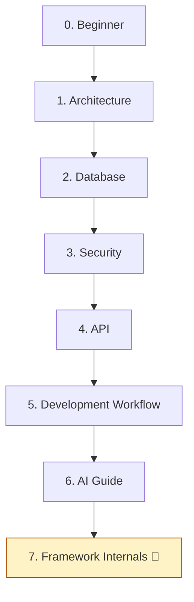

# Learning Path

> A guided reading order for the **DMF PHP Framework** — from first clone to
> framework internals. Each stage builds on the previous one and points to the
> authoritative docs (it never restates them). For the flat list of everything,
> use the [Documentation Index](./INDEX.md); to just get running, use the
> [Quick Start](./QUICK_START.md).
>
> **Runtime note (per [ADR-0003](./ai/DECISIONS.md#adr-0003-framework-boundary--procedural-is-the-runtime-dmfcoredmfauth-activate-only-on-explicit-v2x-migration)):**
> stages 1–7 describe the ✅ **current procedural runtime**. The final stage,
> *Framework Internals*, covers the 🔮 **v2.x target** (`DMF\Core`/`DMF\Auth`) —
> present in the repo but **dormant**; learn it last, and do not treat it as the
> live runtime.

---

## The path

---

## 0. Beginner — get oriented and running

**Goal:** understand what this project is and stand it up locally.

- [README](../README.md) — overview, features, directory layout.
- [Quick Start](./QUICK_START.md) — clone → run → first module.
- [INSTALL](../INSTALL.md) — requirements, `.env`, database setup.

**You can now:** run the app, log in, and see the reference dashboard page.

## 1. Architecture — how the system is shaped

**Goal:** learn the layers and the include-chain request flow.

- [ARCHITECTURE](../ARCHITECTURE.md) — layers, request/security flow, folders.
- [docs/architecture.md](./architecture.md) — concise companion overview.

**You can now:** trace a request from `public_html/` through `includes/` to the DB
and back.

## 2. Database — how data is modeled and evolved

**Goal:** understand the core schema and safe schema change.

- [DATABASE](../DATABASE.md) — schema, conventions, migrations, backups.

**You can now:** read the `users`/`audit_logs` schema and write a numbered
migration.

## 3. Security — the protection baseline

**Goal:** know the controls every page inherits and must uphold.

- [SECURITY](../SECURITY.md) — OWASP-mapped baseline: CSRF, XSS, SQLi, uploads,
  sessions, secrets.

**You can now:** apply CSRF, output escaping, prepared statements, and role gates
correctly.

## 4. API — the request/response contract

**Goal:** build endpoints that speak the platform's JSON envelope.

- [API](../API.md) — endpoint conventions, envelope, status codes, error handling.

**You can now:** write a `public_html/api/*` endpoint with CSRF, validation, and a
transaction.

## 5. Development Workflow — how change ships

**Goal:** work the way CI and reviewers expect.

- [CODING_STANDARD](../CODING_STANDARD.md) — PSR-12, types, naming, tooling.
- [TESTING](../TESTING.md) — PHPUnit, the test pyramid, the merge gate.
- [DEVOPS](../DEVOPS.md) — branches, quality gates, versioning, environments.

**You can now:** branch off `develop`, pass `composer check`, and open a
CI-green PR.

## 6. AI Guide — build with an AI assistant

**Goal:** direct Claude Code / Codex / Copilot / Cursor safely and productively.

- [CLAUDE](../CLAUDE.md) — AI entry point and source-of-truth order.
- [AI_RULES](./ai/AI_RULES.md) — mandatory MUST / MUST NOT / STOP behavior.
- [PROJECT_CONTEXT](./ai/PROJECT_CONTEXT.md) — the ground-truth map.
- [PROMPTS](./ai/PROMPTS.md) — reusable task templates.
- [WORKFLOW](./ai/DEVELOPMENT_WORKFLOW.md) — the Research → Release loop.

**You can now:** run a compliant AI task end-to-end against the current runtime.

## 7. Framework Internals — the v2.x target 🔮

**Goal:** understand the OOP framework that is present but **dormant**. Learn this
only when your application explicitly targets v2.x (see the activation rule in
[ADR-0003](./ai/DECISIONS.md#adr-0003-framework-boundary--procedural-is-the-runtime-dmfcoredmfauth-activate-only-on-explicit-v2x-migration)).

- [CLASS_DIAGRAM](../CLASS_DIAGRAM.md) — `DMF\Core` class map.
- [BOOTSTRAP](../BOOTSTRAP.md) — the kernel & service container.
- [LIFECYCLE](../LIFECYCLE.md) — OOP request lifecycle.
- [AUTHENTICATION](../AUTHENTICATION.md) · [ROLE_MODEL](../ROLE_MODEL.md) ·
  [ACL](../ACL.md) · [SESSION_FLOW](../SESSION_FLOW.md) — the `DMF\Auth` package.

**You can now:** evaluate a v2.x migration — **without** auto-switching any app;
migration requires explicit approval (ADR-0003).

---

## At a glance

| Stage | Focus | Runtime | Primary doc |
| ----- | ----- | ------- | ----------- |
| 0 | Beginner | ✅ | [README](../README.md), [Quick Start](./QUICK_START.md) |
| 1 | Architecture | ✅ | [ARCHITECTURE](../ARCHITECTURE.md) |
| 2 | Database | ✅ | [DATABASE](../DATABASE.md) |
| 3 | Security | ✅ | [SECURITY](../SECURITY.md) |
| 4 | API | ✅ | [API](../API.md) |
| 5 | Dev Workflow | ✅ | [DEVOPS](../DEVOPS.md) |
| 6 | AI Guide | — | [CLAUDE](../CLAUDE.md) |
| 7 | Framework Internals | 🔮 | [CLASS_DIAGRAM](../CLASS_DIAGRAM.md) |

✅ current procedural runtime · 🔮 v2.x target (dormant).

---

DMF PHP Framework · Learning Path · guided reading order, pointers only ·
© 2026 Digital Media Foundation
