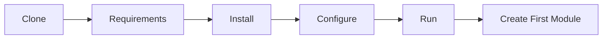

# Quick Start

> Get a DMF application running from a clean clone in six steps, then build your
> first module. This is the **fast path** — it points to the authoritative guides
> rather than repeating them. Runtime: ✅ **procedural v1.x** (the current wired
> runtime, per [ADR-0003](./ai/DECISIONS.md#adr-0003-framework-boundary--procedural-is-the-runtime-dmfcoredmfauth-activate-only-on-explicit-v2x-migration)).
>
> New here? See the [Documentation Index](./INDEX.md) for the full map, or the
> [Learning Path](./LEARNING_PATH.md) for a guided reading order.

---

## The path



---

## 1. Clone

```bash
git clone https://github.com/dmf/dmf-template-php.git my-service
cd my-service
```

Or use GitHub's **Use this template** button to start a new repository.

## 2. Requirements

You need **PHP ≥ 8.1**, **Composer 2.x** (dev tooling only), **Apache 2.4+**, and
**MySQL 8.0+ / MariaDB 10.5+**, plus the `pdo_mysql`, `openssl`, and `mbstring`
extensions.

→ Full list and recommended `php.ini`: [INSTALL › Requirements](../INSTALL.md#requirements).

## 3. Install

```bash
composer install          # PHPStan, PHPUnit, PHP-CS-Fixer (dev tooling)
```

Import the core schema and seed:

```bash
mysql -u dmf_app -p dmf_app < database/migrations/0001_core_schema.sql
mysql -u dmf_app -p dmf_app < database/seeds/0001_seed.sql
```

→ Windows/Linux specifics and DB user setup: [INSTALL › Local Installation](../INSTALL.md#local-installation).

## 4. Configure

```bash
cp .env.example .env       # then edit .env with your real values
```

Set at least `APP_ENV`, `APP_DEBUG`, `DB_*`, and `SESSION_TIMEOUT`. Secrets live
**only** in `.env` (git-ignored) — never in source.

→ Every variable: [INSTALL › Environment Variables](../INSTALL.md#environment-variables) ·
secrets policy: [SECURITY › Secrets Management](../SECURITY.md#secrets-management).

## 5. Run

Point your web server **document root at `public_html/`** (never the project
root), make `storage/` writable, then browse to the app:

```bash
chmod -R 775 storage
# visit http://localhost/  → redirects to /auth/login.php
```

Sign in with the seeded admin, then **change the password immediately**:

| Username | Password |
| -------- | -------- |
| `admin`  | `ChangeMe123!` |

→ Production hosting (Apache/DirectAdmin, HTTPS): [DEPLOYMENT](../DEPLOYMENT.md) ·
post-install checklist: [INSTALL › Post-Installation Checklist](../INSTALL.md#post-installation-checklist).

## 6. Create First Module

Every authenticated page follows the **canonical include chain**. A new module is
four small pieces:

1. **Migration** — add `database/migrations/0002_add_<module>_table.sql`
   (sequential number, never edit an applied file). See
   [DATABASE › Migration Strategy](../DATABASE.md#migration-strategy).
2. **Route** — add a dot-namespaced key to the `ROUTES` map in
   `includes/routes.php`. See [ARCHITECTURE › Component Map](../ARCHITECTURE.md#component-map).
3. **Page** — create `public_html/<module>/index.php` using the include chain:

   ```php
   <?php
   declare(strict_types=1);

   require_once __DIR__ . '/../../includes/auth_check.php';  // session → $currentUser, $role
   require_once __DIR__ . '/../../includes/permission.php';  // RBAC helpers
   require_once __DIR__ . '/../../includes/routes.php';      // link helpers
   requirePermission(hasRole($role, 'admin'));               // gate (optional)

   // SQL via $conn (prepared statements) → compute view → render HTML
   require_once __DIR__ . '/../../includes/navbar.php';      // shared navigation
   ```

4. **API endpoint** (optional) — add `public_html/api/<verb>_<module>.php`
   returning the standard JSON envelope, with `csrf_require()` + a role gate. See
   the [API worked example](../API.md#worked-example).

> This module is **application** code — it does not belong in the template
> repository itself ([AI_RULES › Scope](./ai/AI_RULES.md#5-scope--business-logic-rules--source-readmemd-workspace-claudemd)).

→ Ready-made prompt for scaffolding a full CRUD module:
[PROMPTS › CRUD Module](./ai/PROMPTS.md#5-crud-module).

---

## What next

| Goal | Go to |
| ---- | ----- |
| Understand the whole system | [ARCHITECTURE](../ARCHITECTURE.md) |
| Follow the code rules | [CODING_STANDARD](../CODING_STANDARD.md) |
| Learn in a guided order | [Learning Path](./LEARNING_PATH.md) |
| Work with an AI assistant | [CLAUDE](../CLAUDE.md) · [docs/ai](./ai/AI_RULES.md) |
| See every document | [Documentation Index](./INDEX.md) |

---

<sub>DMF PHP Framework · Quick Start · fast path, pointers only · © 2026 Digital
Media Foundation</sub>
