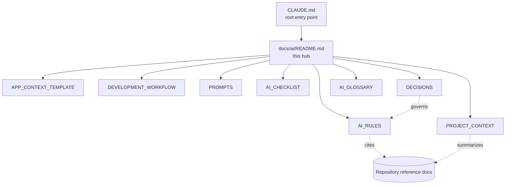

# AI Development Guide

> Navigation hub for the DMF PHP Framework's AI documentation — the guidance that
> governs how AI coding assistants (Claude Code, OpenAI Codex, GitHub Copilot,
> Cursor, and future tools) work in this repository and in every application
> generated from it.
>
> **This page is navigation only.** It maps and orders the AI documents; it does
> not restate their content. Follow the links for the actual rules and detail.

---

## Where this sits

- The **entry point** is [`CLAUDE.md`](../../CLAUDE.md) at the repository root —
  Claude Code auto-loads it. It is intentionally thin and routes into the
  documents below.
- The **detailed AI documents** live here, under `docs/ai/`.
- For the whole repository's documentation, see the
  [Documentation Index](../INDEX.md).

---

## AI documentation map

The AI documents **cite and operationalize** the repository's reference docs
(ARCHITECTURE, CODING_STANDARD, SECURITY, DATABASE, API, TESTING). They never
override them — on any conflict, the reference docs and the actual source code win.

---

## Recommended reading order

| # | Document | Read it to… |
| - | -------- | ----------- |
| 1 | [CLAUDE.md](../../CLAUDE.md) | Get identity, current architecture, and source-of-truth order. |
| 2 | [PROJECT_CONTEXT](./PROJECT_CONTEXT.md) | Learn the ground-truth map before writing anything. |
| 3 | [AI_RULES](./AI_RULES.md) | Absorb the mandatory MUST / MUST NOT / STOP behavior. |
| 4 | [DEVELOPMENT_WORKFLOW](./DEVELOPMENT_WORKFLOW.md) | Follow the Research → Release loop. |
| 5 | [PROMPTS](./PROMPTS.md) | Pick a ready-made, rule-compliant task template. |
| 6 | [AI_CHECKLIST](./AI_CHECKLIST.md) | Self-verify at each gate before proposing a PR. |
| 7 | [APP_CONTEXT_TEMPLATE](./APP_CONTEXT_TEMPLATE.md) | Give a specific application its own context (copy per app). |
| 8 | [DECISIONS](./DECISIONS.md) | Understand the recorded architectural decisions (incl. ADR-0003). |
| 9 | [AI_GLOSSARY](./AI_GLOSSARY.md) | Resolve any term with its v1.x / v2.x sense. |

---

## Purpose of each document

| Document | Purpose (one line) |
| -------- | ------------------ |
| [CLAUDE.md](../../CLAUDE.md) | Root entry point: identity, current architecture, source-of-truth order, links. |
| [AI_RULES](./AI_RULES.md) | Enforceable guardrails, each citing its source doc. |
| [PROJECT_CONTEXT](./PROJECT_CONTEXT.md) | AI-optimized ground-truth map of the repository + known gaps. |
| [APP_CONTEXT_TEMPLATE](./APP_CONTEXT_TEMPLATE.md) | Per-application context template to copy into each new app. |
| [DEVELOPMENT_WORKFLOW](./DEVELOPMENT_WORKFLOW.md) | The task→merge loop, STOP conditions, Definition of Done. |
| [PROMPTS](./PROMPTS.md) | Reusable, task-shaped prompt templates with acceptance criteria. |
| [AI_CHECKLIST](./AI_CHECKLIST.md) | Gate checklists (security, DB, review, release, …). |
| [DECISIONS](./DECISIONS.md) | ADR log — significant, hard-to-reverse decisions. |
| [AI_GLOSSARY](./AI_GLOSSARY.md) | Shared framework vocabulary. |

---

## Relationship with `CLAUDE.md`

[`CLAUDE.md`](../../CLAUDE.md) is the **root entry point** an AI reads first; this
README is the **hub** it routes into. `CLAUDE.md` stays thin (so it is cheap to
auto-load) and delegates all detail to the documents above. If the two ever
appear to disagree, `CLAUDE.md` plus the reference docs are authoritative.

## Relationship with the repository documentation

The AI documents are a **derived, navigational layer** over the repository's
reference documentation:

- They **summarize** it (PROJECT_CONTEXT), **condense its rules** (AI_RULES),
  **operationalize it into prompts** (PROMPTS), and **sequence it** (WORKFLOW).
- They **do not duplicate or replace** it. The reference docs
  (ARCHITECTURE, CODING_STANDARD, SECURITY, DATABASE, API, TESTING) and the actual
  source code remain the source of truth, per
  [AI_RULES › Decision Hierarchy](./AI_RULES.md#0-decision-hierarchy-what-wins).

For everything outside the AI guide, return to the
[Documentation Index](../INDEX.md).

---

DMF PHP Framework · AI Development Guide (navigation hub) · pointers only ·
© 2026 Digital Media Foundation
